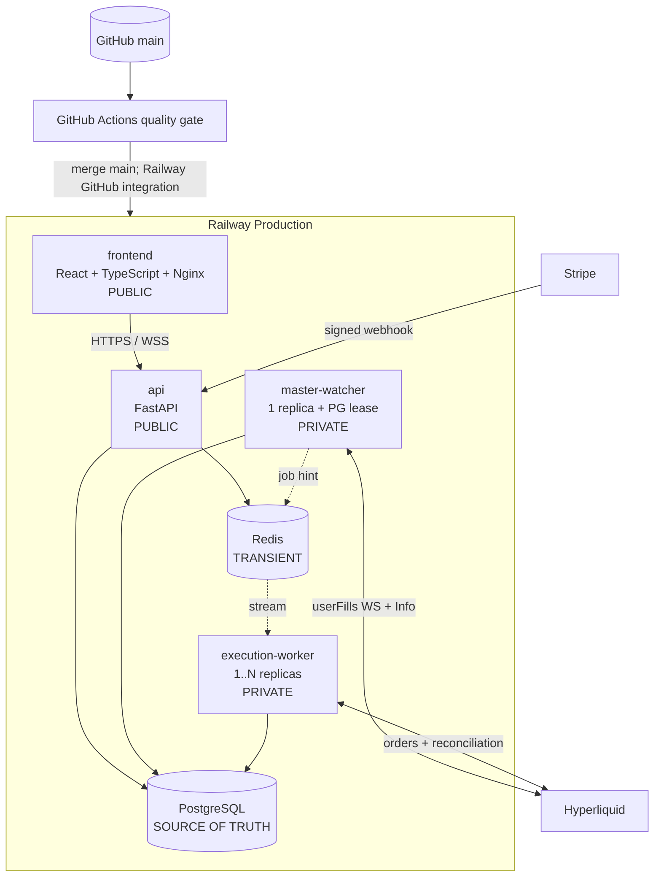

# HyperCopy

Production-oriented SaaS platform for **hybrid trading execution on Hyperliquid Perpetuals**.

HyperCopy applies to each connected account a strategy whose source trading process combines **human analysts and AI systems**. The platform itself is responsible for controlled execution, proportional sizing, leverage/margin synchronization, risk management, reconciliation, auditability and account-level monitoring.

**Mandatory deployment path:** GitHub → Railway → Hyperliquid.

`SPEC.md` is the product/architecture source of truth. This repository is the concrete implementation candidate derived from that specification. Mainnet trading remains deliberately gated until testnet, chaos, restore and rollback validation are completed.

> Note: internal identifiers such as `CopyJob`, `copy_state` and `/copy/*` are legacy technical names in the execution engine. They are not the product positioning and do not mean the user-facing service is presented as social/copy trading.

## Architecture



PostgreSQL owns `master_events → copy_jobs → executions → fills`, the position ledger, subscriptions, risk state, audit and incidents. Redis is limited to queue delivery hints, consumer coordination, rate limiting, short-lived auth state and realtime fan-out. If Redis disappears, correctness is reconstructed from PostgreSQL plus the real Hyperliquid state.

## Trading correctness

The engine performs **hybrid position targeting**, not blind fill replication. A source-strategy fill is the low-latency trigger, but each account order is the delta between the account's current managed position and the target implied by the strategy source's current exposure ratio. Periodic reconciliation converges the ledger after partial fills, missed events, rejects and restarts.

The source strategy is produced outside the execution layer by a hybrid decision process that combines analyst input and AI-assisted systems. HyperCopy does not claim that the execution engine independently invents those trades: it receives the resulting source positioning and applies it to connected accounts under each user's Risk Engine limits.

Every external order is preceded by a durable `Execution(SUBMITTING)` row and a deterministic 128-bit Hyperliquid `cloid`. Ambiguous outcomes are resolved against Hyperliquid before any further action; reconciliation refuses to create a replacement job while an unresolved external effect exists.

## Security model

Users authenticate by wallet signature. The session is held in an HttpOnly cookie; CSRF is enforced on mutations. Trading uses a named Hyperliquid API/agent wallet; the main wallet private key is rejected. Credentials use envelope encryption: a random per-record DEK encrypts the agent key with AES-256-GCM and AAD bound to user/account identity. Local/test environments can wrap DEKs with a Railway environment KEK; production mainnet requires the external KMS provider shipped here (`aws_kms`), with decrypt permission granted only to `execution-worker`.

Mainnet requires all three independent gates: `HYPERLIQUID_NETWORK=mainnet`, `ENABLE_LIVE_TRADING=true`, and PostgreSQL `system_flags.live_trading=true` set explicitly by a SUPERADMIN.

## Repository

```text
.
├── .github/               CI, CodeQL, Dependabot
├── backend/               FastAPI, workers, engines, Alembic, tests
├── frontend/              React/TS production build served by Nginx
├── scripts/               recovery, seed, shadow and release utilities
├── docs/                  architecture/API/deployment/security/runbook
├── SPEC.md                definitive product/architecture specification
├── docker-compose.yml     local stack
├── .env.example           non-secret variable catalogue
├── DEPLOYMENT.md
├── SECURITY.md
├── RUNBOOK.md
├── ROADMAP.md
└── DEFINITION_OF_DONE.md
```

## Local start

```bash
cp .env.example .env
python scripts/generate_keys.py
# copy generated local-only values into .env
docker compose up --build
```

Then open `http://localhost:5173`. API health is `http://localhost:8000/health/ready` and development OpenAPI is `http://localhost:8000/docs`.

For the exact Railway setup, service variables, domains, migration strategy, backup/restore and rollback procedure, follow **`DEPLOYMENT.md`** and **`RUNBOOK.md`**.

## Release rule

A successful build is not permission to trade real funds. Mainnet activation is blocked until `DEFINITION_OF_DONE.md` is completed against a real staging/production Railway project and Hyperliquid testnet/mainnet shadow run.
