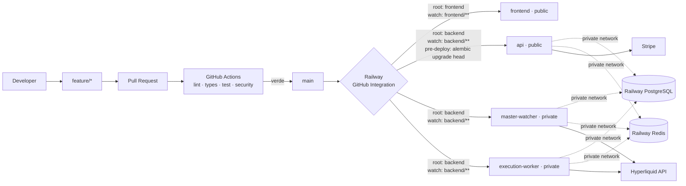

# HyperCopy — Specifica tecnica definitiva

Piattaforma SaaS di copytrading su Hyperliquid Perpetuals.
Percorso obbligato: **GitHub → Railway → Hyperliquid**.

Documento unico che funge da specifica tecnica, architecture blueprint, deployment
blueprint, security blueprint, roadmap e base per il repository di produzione.

**Convenzioni di affidabilità usate in tutto il documento**

| Tag | Significato |
| --- | --- |
| `VERIFIED` | Confermato contro documentazione ufficiale Hyperliquid/Stripe, con fonte |
| `DECISION` | Scelta progettuale, motivata |
| `ASSUMPTION` | Ipotesi ragionevole, da confermare prima del mainnet |
| `OPEN` | Da verificare prima dell'implementazione |

---

## 1. Executive Verdict

Nessuno dei quattro output è utilizzabile con denaro reale, ma per ragioni diverse
e non sovrapposte.

**Output C e D vanno scartati integralmente**: contengono API Hyperliquid
inesistenti (`Exchange(wallet=..., secret_key=...)`, `WebsocketManager("mainnet")`),
`await` su metodi SDK sincroni, Fernet spacciato per AES-256, logica mock nel
percorso critico del rischio, chiavi private principali degli utenti in database
ed endpoint kill-switch senza alcuna autenticazione. D usa inoltre una chiave di
cifratura di default hardcoded.

**Output A e B sono entrambi seri e complementari.** B possiede l'idea singola più
importante di tutto il materiale: **intento durevole scritto in PostgreSQL prima
dell'effetto esterno, con `cloid` deterministico e riconciliazione per `cloid`**
dopo fallimenti ambigui. Questo rende matematicamente impossibile l'ordine
duplicato su timeout di rete. A non ha nulla di equivalente: registra il trade
*dopo* la risposta dell'exchange e affida l'idempotenza per-utente al solo Redis,
violando un vincolo esplicito. In compenso A ha risk engine, crittografia
(envelope + AAD legato allo user_id), metriche e frontend nettamente superiori.

Entrambi condividono però tre difetti strutturali che li rendono inadatti alla
produzione: **replicano i fill invece di convergere sulla posizione target**,
**non hanno reconciliation engine**, e **non hanno alcun lease di singleton sul
watcher** — durante un redeploy Railway due watcher coesistono.

Il difetto più grave non è però in nessuno dei quattro. `VERIFIED`: Hyperliquid
impone **1200 unità di peso al minuto per indirizzo IP**, dove `clearinghouseState`
pesa 2 e un ordine pesa 1. Un fan-out ingenuo consuma ~3 unità per follower per
fill: con 100 follower il sistema satura a **~4 operazioni master al minuto**.
Su Railway le repliche condividono l'IP di egress, quindi scalare i worker
*peggiora* il problema. Nessun output lo affronta.

La soluzione unificata risolve i due problemi con la stessa mossa: un **ledger di
posizione mantenuto in PostgreSQL** alimentato dalle nostre risposte d'ordine e
corretto da reconciliation periodica. Elimina la lettura `user_state` per follower
per fill (il collo di bottiglia) e simultaneamente abilita il **position targeting**
(la correttezza). Sopra, un rate limiter a token bucket pesato e condiviso in Redis.

---

## 2. Audit degli output

### Output A — `Hl_Copytrader.zip`

~4.765 righe backend, ~2.764 frontend. Compila, 20 test passano, build Vite verde.

**Architettura.** Separazione pulita `core/db/models/schemas/services/api/workers`.
Due processi (api, worker) più migrate gating su `service_completed_successfully`.
Ma **il fan-out avviene in-process** con `asyncio.gather` dentro il processo
watcher: nessuna coda, nessuna durabilità. Un crash a metà fan-out perde
irreversibilmente le repliche non ancora eseguite.

**Trading engine.** Doppio canale WS + polling di recupero convergenti su un
handler idempotente: idea corretta e ben motivata. Sizing per equity weight sulle
aperture e **per frazione di posizione sulle chiusure** — quest'ultima è
superiore all'approccio di B e riduce il residuo. Arrotondamento verso il basso
con motivazione corretta (evitare il flip della posizione). Gestisce `szDecimals`
e le regole a 5 cifre significative sul prezzo.

Ma: **nessun `cloid`**. Se `market_open` va in timeout dopo che l'exchange ha
accettato, A non ha modo di sapere se l'ordine esiste. Peggio: `CopyTrade` viene
scritto solo *dopo* la risposta, quindi in caso di crash non resta traccia
dell'intento, mentre `claim_once` ha già consumato la chiave Redis — la replica è
persa e irrecuperabile. Nessuna reconciliation, nessun retry, nessuna dead letter.

**Sicurezza.** Il punto forte. Envelope encryption reale: DEK per record, wrappata
da KEK, AAD legata allo `user_id` — un blob copiato tra righe non decifra.
Versioning KEK e `rewrap` per la rotazione. Redazione dei campi sensibili
nell'audit. Rifiuta la chiave dell'account principale in favore dell'agent wallet.
Ma: **non verifica su Hyperliquid che l'agent sia effettivamente approvato**, non
controlla la scadenza, token in `localStorage`, nessun rate limiting applicativo.

**Risk engine.** Il migliore dei quattro. Kill switch, entitlement, filtri asset,
drawdown, cap per-trade con *trimming* invece di rifiuto, leva calcolata sull'intero
book, conteggio posizioni, margine libero, minimo d'exchange. Due asimmetrie
deliberate e corrette: abbonamento scaduto e drawdown sforato bloccano le aperture
ma mai le uscite.

**UX.** Nettamente la migliore. La `FanoutTape` che unisce il fill master alla
replica con un connettore e mostra il peso% usato dall'engine è un'idea di
prodotto genuina: rende visibile la *lineage*. Mostra le operazioni rifiutate con
motivazione leggibile invece di nasconderle. Metriche Sharpe con annualizzazione
dedotta dalla cadenza osservata.

**Deployment.** Il punto debole. Docker Compose corretto ma **zero configurazione
Railway, zero CI, `/health` unico** senza distinzione live/ready, nessun lease sul
watcher (si affida a una frase nel README), nessun `ENABLE_LIVE_TRADING`.

### Output B — `hypercopy-source.zip`

~2.224 righe backend, ~415 frontend.

**Architettura.** Quattro processi (api, watcher, copy worker, metrics worker) con
**Redis Streams e consumer group** — la scelta corretta rispetto al Pub/Sub.
Dead letter dopo N retry, backoff, e consumer name stabile che rilegge i pending
al riavvio: restart-safe by design.

**Trading engine.** Qui B è chiaramente avanti. Il pattern è:

1. scrive `CopyTrade` con `client_order_id` deterministico e **committa**;
2. solo dopo invia l'ordine;
3. su eccezione ambigua chiama `_reconcile_pending`, che cerca il `cloid` nei
   fill e poi in `query_order_by_cloid`;
4. se resta ambiguo solleva `TransientCopyError` e **non fa ACK dello stream**.

Inoltre, prima di ri-sottomettere un intento in stato `unknownOid`, **rivaluta lo
stato di sicurezza corrente** (kill switch, abbonamento, limiti): un retry non
resuscita un ordine che nel frattempo è diventato vietato. È un dettaglio che
tradisce vera comprensione del dominio.

`VERIFIED`: il `cloid` generato con `blake2b(digest_size=16).hexdigest()` produce
32 caratteri hex, prefissati `0x` — esattamente i 128 bit richiesti dalla doc.

Il vincolo `uq_copy_user_source_fill` mette l'idempotenza in PostgreSQL, non solo
in Redis. `stripe_events.event_id` unique fa lo stesso per i webhook.

Ma: **il fan-out è seriale dentro una singola entry di stream**. `handle()` cicla
su tutti gli utenti in un `for`. Un follower lento blocca gli altri, e un singolo
`TransientCopyError` fa ritentare l'intero batch. Viola esplicitamente il
requisito "un follower lento non deve bloccare gli altri". E `copy_consumer` è
una costante di configurazione: scalare a N repliche fa sì che tutte usino lo
stesso nome consumer, rompendo il modello di ownership.

**Integrazione Hyperliquid.** La più accurata delle quattro. Usa `Cloid`,
`query_order_by_cloid`, `extra_agents` per verificare on-chain che l'agent sia
approvato e non scaduto, `meta()` per `szDecimals`/`maxLeverage`/`onlyIsolated`,
e ricostruisce a mano l'IOC reduce-only perché `market_open` non lo supporta —
ragionamento corretto. La lista esaustiva degli stati terminali di rifiuto è
verosimile e utile.

Difetti: `market_limits` è `lru_cache` senza scadenza (nuovi listing invisibili);
`update_leverage` viene chiamato **a ogni ordine**, sprecando peso di rate limit.

**Sicurezza.** Più debole di A. AES-256-GCM diretto senza envelope, **AAD statica
`hypercopy:v1`**: un ciphertext copiato da una riga all'altra decifra
correttamente. Nessun versioning, nessuna rotazione. Token in `localStorage`.

**Risk engine.** Molto povero: solo cap sul notional e sizing. Nessun controllo su
leva, numero posizioni, margine libero, whitelist asset, perdita giornaliera.
Il drawdown è gestito inline nel copy engine e **imposta `user.kill_switch = True`**,
confondendo lo stop automatico di rischio con il kill switch dell'utente: l'utente
non distingue più chi ha fermato cosa.

**Metriche.** Sharpe su chiusure giornaliere UTC con annualizzazione √365.25 e
motivazione esplicita contro l'annualizzazione del rumore infra-giornaliero.
Approccio più standard di quello di A.

**UX.** Minimale (415 righe totali). Funzionale ma senza profondità.

**Deployment.** Come A: nessuna configurazione Railway, nessuna CI, `/health` unico.

### Output C — documento inline "Piattaforma di Copytrading"

**API inventate.** `Exchange(wallet=ADDRESS, secret_key=KEY, base_url=...)` non
esiste: la firma reale è `Exchange(wallet: LocalAccount, base_url, ...)`.
`await self.info.user_state(...)` fallisce perché `Info.user_state` è sincrono.

**Crittografia sbagliata ed etichettata male.** Usa `Fernet` sotto un'intestazione
"Crittografia AES-256". Fernet è AES-128-CBC con HMAC.

**Custodia.** Chiede e conserva la **chiave privata principale** dell'utente. Peggio,
configura `MASTER_WALLET_PRIVATE_KEY`: per monitorare il master serve solo
l'indirizzo. È una passività pura.

**Logica mock nel percorso critico.** `RiskManager._get_equity` ritorna `10000`,
`_get_peak_equity` ritorna `12000`, `_calculate_pnl` ritorna `0`. Il risk engine
è decorativo.

**Duplicazione ordini garantita in scale-out.** Il motore parte con
`asyncio.create_task` nello `startup` dell'app FastAPI: ogni replica API esegue il
proprio copier. Due repliche = ogni ordine duplicato.

**Altro.** Autenticazione email/password (il requisito chiede Web3),
`allow_origins=["*"]` con `allow_credentials=True` (combinazione che i browser
rifiutano), SQLAlchemy sincrono dentro handler async, `func` non importato dove
usato.

### Output D — documento inline "Creare una piattaforma di copytrading"

**API inventate.** `from hyperliquid.websocket_manager import WebsocketManager` e
`WebsocketManager("mainnet")`: la classe non si usa così, il canale pubblico è
`Info(base_url, skip_ws=False).subscribe(...)`. `market_open(coin=..., sz=...)`
fallisce: il parametro dell'SDK è `name`, non `coin`.

**Sicurezza catastrofica.** `SECRET_KEY = os.getenv("ENCRYPTION_KEY", "super-secret-key-for-dev")`
— default hardcoded funzionante. Salt PBKDF2 costante. Fernet di nuovo etichettato
AES-256. `POST /api/user/kill-switch` accetta `active: bool` **senza alcun contesto
utente né autenticazione**: chiunque può disattivare il copytrading di chiunque.

**Sizing non proporzionale.** `raw_size = master_sz * user_multiplier`. Ignora
l'equity del follower: contraddice il requisito centrale. E dichiara apertamente
"normalizzazione della size e controllo limiti omessi per brevità" — cioè gli
ordini verranno rifiutati per precisione.

**Blocca il socket.** `dispatch_trade` cicla sugli utenti dentro il callback
WebSocket, sul thread del socket.

**Dashboard finta.** `{"pnl_daily": "+12.4%", "sharpe_ratio": 1.8}` hardcoded.
Celery in `requirements.txt` e mai usato.

---

## 3. Scorecard

Voti 0–10. Il totale è diagnostico, non elettivo.

| Area | Peso | A | B | C | D |
| --- | ---: | ---: | ---: | ---: | ---: |
| Correttezza tecnica | 15% | 7.5 | 8.0 | 2.0 | 1.0 |
| Trading reliability | 20% | 4.5 | 7.5 | 1.0 | 0.5 |
| Sicurezza | 20% | 7.5 | 5.5 | 1.5 | 0.5 |
| Hyperliquid correctness | 10% | 7.0 | 9.0 | 2.0 | 1.0 |
| Architettura | 10% | 6.5 | 8.0 | 2.5 | 1.5 |
| UX utente | 7.5% | 9.0 | 4.5 | 3.0 | 2.5 |
| UX admin | 5% | 7.0 | 5.0 | 2.5 | 1.0 |
| Deployability GitHub/Railway | 5% | 2.0 | 2.0 | 1.5 | 1.0 |
| Manutenibilità | 5% | 8.0 | 7.5 | 3.0 | 2.0 |
| Scalabilità | 2.5% | 3.0 | 6.0 | 1.0 | 0.5 |
| **Totale ponderato** | 100% | **6.60** | **6.96** | **1.85** | **1.05** |

**Lettura.** B vince di misura, trainato da trading reliability e correttezza
Hyperliquid — le due aree che pesano di più insieme (30%). A lo batte nettamente
su sicurezza e UX. Nessuno dei due supera 7: entrambi mancano reconciliation,
singleton del watcher e qualunque configurazione Railway, che è il vincolo
infrastrutturale obbligatorio.

Conclusione operativa: **si prende il trading core di B, la sicurezza e la UX di
A, e si progetta ex novo tutto ciò che riguarda convergenza dello stato, rate
limiting e deployment.**

---

## 4. Errori, omissioni e rischi

### CRITICAL

| # | Problema | Dove | Conseguenza |
| --- | --- | --- | --- |
| C1 | Rate limit IP 1200 peso/min non considerato | **tutti** | Il sistema satura a ~4 fill/min con 100 follower. Su Railway le repliche condividono l'IP: scalare peggiora |
| C2 | Nessun `cloid`, intento scritto dopo l'ordine | A, C, D | Timeout di rete dopo l'accettazione → ordine duplicato o replica persa senza traccia |
| C3 | Idempotenza per-utente solo su Redis | A | Flush/perdita Redis → riesecuzione degli ordini |
| C4 | Nessun lease singleton sul watcher | **tutti** | Overlap di deploy Railway = due watcher = eventi e ordini duplicati |
| C5 | Copy engine dentro il processo API | C | Ogni replica API copia: duplicazione garantita in scale-out |
| C6 | Kill switch senza autenticazione | D | Chiunque disattiva il copytrading di chiunque |
| C7 | Chiave di cifratura di default hardcoded | D | Tutte le chiavi decifrabili da chiunque legga il repo |
| C8 | Chiave privata principale dell'utente in DB | C, D | Breach del DB = prelievo dei fondi, non solo trading |
| C9 | Logica mock nel risk engine | C | Nessun limite realmente applicato |
| C10 | Nessuna reconciliation | **tutti** | Un evento perso resta perso: drift permanente e silenzioso |
| C11 | API SDK inesistenti | C, D | Non esegue |

### HIGH

| # | Problema | Dove | Conseguenza |
| --- | --- | --- | --- |
| H1 | Trade replication invece di position targeting | A, B | Divergenza cumulativa: fill mancati, fill parziali e rifiuti non vengono mai recuperati |
| H2 | Fan-out seriale su un'unica entry di stream | B | Un follower lento blocca tutti; un transient fa ritentare l'intero batch |
| H3 | `copy_consumer` costante | B | Scalando a N repliche tutte condividono il nome consumer: ownership rotta |
| H4 | AAD statica nella cifratura | B | Ciphertext trasferibile fra righe |
| H5 | Nessun fan-out durevole | A | Crash a metà = repliche perse |
| H6 | Drawdown automatico scritto su `user.kill_switch` | B | L'utente non distingue stop di rischio da proprio kill switch |
| H7 | Scadenza agent wallet ignorata | A, C, D | `VERIFIED`: max 180 giorni. Alla scadenza tutti gli ordini falliscono senza preavviso |
| H8 | Nessun `ENABLE_LIVE_TRADING` | **tutti** | Una sola variabile mal configurata porta al mainnet |
| H9 | Token in `localStorage` | A, B | XSS = furto sessione |
| H10 | Nessuna configurazione Railway né CI | **tutti** | Il vincolo infrastrutturale obbligatorio non è soddisfatto |
| H11 | Nessun `/health/live` + `/health/ready` | **tutti** | Railway instrada traffico verso repliche non pronte |

### MEDIUM

| # | Problema | Dove |
| --- | --- | --- |
| M1 | `update_leverage` a ogni ordine (peso sprecato) | B |
| M2 | `lru_cache` senza TTL su `market_limits` | B |
| M3 | Risk engine privo di leva/posizioni/margine/asset | B |
| M4 | Nessun `expiresAfter` sugli ordini | tutti |
| M5 | SQLAlchemy sincrono in handler async | C |
| M6 | `allow_origins=["*"]` con credentials | C |
| M7 | Nessuna dead letter | A |
| M8 | Metriche mostrate senza minimo campionario | C, D |

### LOW

| # | Problema | Dove |
| --- | --- | --- |
| L1 | Celery dichiarato e mai usato | D |
| L2 | `func` non importato | C |
| L3 | Nessuna paginazione admin | C, D |

---

## 5. Best Ideas Matrix

| Idea | Origine | Perché conservarla | Modifiche necessarie |
| --- | --- | --- | --- |
| Intento durevole in PG prima dell'effetto esterno | **B** | Unica difesa reale contro il duplicato su timeout | Estendere alla catena `CopyJob → Execution` |
| `cloid` deterministico `blake2b(user, event)` | **B** | 128 bit `VERIFIED`, riconciliabile, gratuito | Derivare da `copy_job_id`, non dal fill: sopravvive al re-targeting |
| Riconciliazione per `cloid` (fills → `query_order_by_cloid`) | **B** | Risolve l'ambiguità con l'exchange come arbitro | Aggiungere budget di rate limit; `userFills` pesa 20 |
| Rivalutare la safety prima di un retry | **B** | Un retry non deve resuscitare un ordine ora vietato | Estendere a global pause ed emergency stop |
| Redis Streams + consumer group + dead letter | **B** | Consegna durevole, non Pub/Sub | Un job **per follower**, non per fill; consumer name da hostname |
| Verifica `extra_agents` on-chain | **B** | Prova che l'agent è approvato e non scaduto | Aggiungere monitor di scadenza proattivo (180gg) |
| Reduce-only via IOC manuale | **B** | `market_open` non supporta reduce-only | Mantenere; usare per il delta negativo |
| Sharpe su chiusure giornaliere UTC | **B** | Evita di annualizzare rumore infra-giornaliero | Minimo 20 osservazioni prima di mostrarlo |
| Envelope encryption con AAD = `user_id` | **A** | Blob non trasferibile fra righe; rotazione senza re-encrypt | Caricare la KEK da secret manager, non da env, in prod |
| Risk engine con trimming invece di rifiuto | **A** | Un ordine sopra il cap torna al cap: più utile del rifiuto | Spostare su delta notional |
| Asimmetria: uscite sempre permesse | **A** | Nessuno resta bloccato in leva per un pagamento fallito | Estendere: vale anche in global pause |
| Chiusure per frazione di posizione | **A** | Riduce il residuo rispetto al ricalcolo per equity | Superata dal position targeting, ma resta il fallback |
| Arrotondamento verso il basso | **A** | Evita di superare la posizione e invertirla | Mantenere invariata |
| Redazione dei campi sensibili nell'audit | **A** | L'audit non diventa un secondo key store | Mantenere invariata |
| `FanoutTape` con lineage e peso% | **A** | Rende visibile *perché* la size è quella | Aggiungere target/delta/attuale |
| Mostrare le operazioni rifiutate con motivo | **A** | Un'assenza non spiegata è il peggior stato possibile | Mantenere invariata |
| Doppio canale WS + polling convergente | **A** | Due vie di consegna, un handler idempotente | Sostituire il polling con reconciliation di posizione |
| Migrate come servizio con gating | **A** | Nessun processo parte contro uno schema ignoto | Diventa Railway Pre-Deploy Command |

---

## 6. Cosa scartare

| Elemento | Presente in | Motivazione dello scarto |
| --- | --- | --- |
| Custodia della chiave principale utente | C, D | L'agent wallet dà esattamente i permessi necessari. Custodire la chiave principale aggiunge il rischio di prelievo senza alcun beneficio |
| Fernet | C, D | AES-128-CBC+HMAC etichettato AES-256. Non è authenticated encryption a 256 bit e non supporta AAD |
| `MASTER_WALLET_PRIVATE_KEY` | C | Per monitorare il master serve solo l'indirizzo pubblico |
| Autenticazione email/password | C | Il requisito è Web3. Due sistemi di identità raddoppiano la superficie senza aggiungere nulla |
| Copy engine nel processo API | C, D | Impedisce lo scale-out dell'API e duplica gli ordini |
| Redis Pub/Sub per job critici | C (implicito) | Consegna at-most-once: un messaggio perso è una replica persa |
| Celery + broker dedicato | D | Redis Streams copre il caso d'uso. Un servizio in meno da gestire su Railway |
| Sizing per solo moltiplicatore | D | Non proporzionale all'equity: contraddice il requisito centrale |
| Kill switch come toggle unico | A (parziale), C, D | Va separato in Pause / Close positions / Global pause / Emergency stop |
| Polling di recupero a finestra temporale | A | Sostituito da reconciliation di posizione, che converge invece di sperare |
| `asyncio.gather` come fan-out | A | Nessuna durabilità, nessun retry, nessuna dead letter |
| `update_leverage` per ordine | B | Peso sprecato. Va impostato all'onboarding e al cambio di configurazione |
| Fan-out seriale per fill | B | Viola l'isolamento fra follower |

---

## 7. Architecture Decision Record

Formato: **Problema → Alternative → Scelta → Motivazione**

**ADR-01 — Repository.**
Multi-repo / monorepo. → **Monorepo.** Railway supporta root directory e watch
paths per servizio, quindi un solo repo non causa redeploy incrociati. Un
cambiamento che tocca schema e frontend resta un solo PR atomico.

**ADR-02 — Modello di copia.**
Trade replication / position targeting / hybrid. → **Hybrid (Modello C).**
L'evento master genera subito un `CopyJob` per latenza bassa, ma il job calcola
un **delta verso una posizione target**, non una copia del fill. La
reconciliation periodica ricalcola gli stessi target. Un fill perso, un ordine
rifiutato o un fill parziale vengono recuperati dal ciclo successivo invece di
restare come deriva permanente. La replication pura (A, B) non converge mai.

**ADR-03 — Watcher.**
Replica singola per configurazione / lease distribuito. → **Lease distribuito in
PostgreSQL.** Railway non garantisce l'assenza di sovrapposizione durante un
redeploy. Il lease sta in PG e non in Redis perché la perdita di Redis non deve
poter creare due watcher attivi. Rinnovo ogni 5s, TTL 15s, fencing token
monotono verificato alla scrittura degli eventi.

**ADR-04 — Coda.**
Redis Pub/Sub / Redis Streams / tabella PostgreSQL. → **Redis Streams con
consumer group, ricostruibile da PostgreSQL.** Pub/Sub è at-most-once: escluso.
Una coda solo-PG con `SKIP LOCKED` sarebbe accettabile e più semplice, ma
Streams dà consumer group e pending list nativi. Vincolo: ogni job deve essere
ricostruibile da `copy_jobs` in PG, così la perdita di Redis costa latenza e non
correttezza.

**ADR-05 — Granularità del job.**
Un job per fill / un job per follower. → **Un job per follower.** Requisito
esplicito: un follower lento non blocca gli altri. Risolve H2 e H3 di B.

**ADR-06 — PostgreSQL.**
Source of truth persistente. Contiene la catena completa
`MasterEvent → CopyJob → Execution → Fill`, il ledger di posizione e il lease.
Ricostruibile da solo, con lo stato Hyperliquid, dopo perdita totale di Redis.

**ADR-07 — Redis.**
Layer transiente: stream dei job, token bucket del rate limit, cache dell'equity,
pub/sub verso la dashboard, nonce SIWE. **Nessuna informazione critica esiste solo
qui.**

**ADR-08 — Signing.**
Chiave principale / agent wallet. → **Agent wallet (API wallet) obbligatorio.**
`VERIFIED`: non può firmare `withdraw3`. Usiamo un agent **nominato**
(`hypercopy`) perché `VERIFIED` un account ha 1 agent senza nome e fino a 3
nominati: prendere quello senza nome entrerebbe in conflitto con altri strumenti
dell'utente.

**ADR-09 — Custodia.**
Envelope encryption AES-256-GCM, DEK per record, KEK esterna, **AAD = `user_id`**.
Prende il modello di A e corregge l'AAD statica di B. La KEK in produzione arriva
da un secret manager esterno; è l'unica dipendenza non-Railway ammessa.

**ADR-10 — Processi.**
Quattro servizi Railway: `api`, `frontend`, `master-watcher`, `execution-worker`.
Il reconciler **non** è un quinto servizio: gira come task nel worker, perché
condivide rate-limit budget e codice di sizing. Un servizio in meno da osservare.

**ADR-11 — WebSocket verso Hyperliquid.**
`VERIFIED`: massimo 10 utenti unici fra le subscription user-specific. Quindi
**non** possiamo sottoscrivere i fill di ogni follower. Solo il master via
`userFills`. Lo stato dei follower si mantiene nel ledger PG più reconciliation.

**ADR-12 — Rate limiting.**
Nessuno / per processo / token bucket condiviso pesato. → **Token bucket in Redis,
pesato per endpoint, condiviso fra tutti i processi.** `VERIFIED`: il limite è per
IP e le repliche Railway condividono l'egress. Un limiter per processo non
protegge nulla.

**ADR-13 — Autenticazione.**
SIWE con nonce monouso in Redis, firma verificata server-side, nonce invalidato
alla verifica. → **Sessione via cookie HttpOnly + Secure + SameSite=Lax**, non
`localStorage`. Corregge H9 di A e B.

**ADR-14 — Stripe.**
Stripe è source of truth. Lo stato locale cambia **solo** su webhook verificato e
persistito in `stripe_events` con `event_id` unique. Il redirect di successo non
concede mai entitlement.

**ADR-15 — Realtime frontend.**
WebSocket per execution, posizioni, stato sistema, alert. REST per settings,
subscription, storico, configurazione admin. Non si usa il WebSocket per dati che
non cambiano da soli.

**ADR-16 — Migrazioni.**
Railway **Pre-Deploy Command** solo sul servizio `api`. Watcher e worker non
migrano mai: elimina la migrazione concorrente.

**ADR-17 — Scaling.**
`master-watcher` resta a 1 replica con lease come rete di sicurezza.
`execution-worker` scala 1→N con consumer name derivato da
`RAILWAY_REPLICA_ID`, ownership del job in PG e `cloid` deterministico.

**ADR-18 — Live trading.**
`ENABLE_LIVE_TRADING=true` **e** `HYPERLIQUID_NETWORK=mainnet` **e** una riga
`system_flags` attiva. Tre condizioni indipendenti: una chiave configurata per
errore non basta.

**ADR-19 — Observability.**
Log strutturati JSON con `correlation_id` propagato lungo tutta la catena. Metriche
esposte da `/metrics` interno. Error tracking esterno (Sentry) ammesso come
eccezione al vincolo Railway.

---

## 8. Architettura definitiva

```mermaid
flowchart TB
    subgraph HL[Hyperliquid]
        WS[userFills WebSocket]
        INFO[Info REST]
        EX[Exchange REST]
    end

    subgraph W[master-watcher · 1 replica + lease]
        LEASE[PG lease + fencing token]
        NORM[Event normalizer]
        FAN[Fan-out planner]
    end

    subgraph EW[execution-worker · 1..N repliche]
        CONS[Stream consumer]
        TGT[Target &amp; delta engine]
        RISK[Risk engine]
        SIGN[Signer memory-only]
        RECON[Reconciler loop]
    end

    subgraph PG[(Railway PostgreSQL — source of truth)]
        ME[master_events]
        CJ[copy_jobs]
        EXEC[executions]
        LEDGER[position_ledger]
        AUD[audit_logs]
    end

    subgraph RD[(Railway Redis — transiente)]
        STREAM[Stream copy_jobs]
        BUCKET[Token bucket pesato]
        CACHE[Cache equity]
        PS[Pub/Sub dashboard]
    end

    API[FastAPI api] --> PG
    API --> RD
    FE[React frontend] --> API
    STRIPE[Stripe] -->|webhook firmato| API

    WS --> NORM
    LEASE -.protegge.-> NORM
    NORM --> ME
    NORM --> FAN
    FAN --> CJ
    FAN --> STREAM

    STREAM --> CONS
    CJ -.ricostruzione se Redis perso.-> CONS
    CONS --> TGT
    TGT --> RISK
    RISK --> SIGN
    SIGN -->|cloid| EX
    EX --> EXEC
    EXEC --> LEDGER
    RECON --> INFO
    RECON --> LEDGER
    RECON --> CJ

    BUCKET -.governa.-> EX
    BUCKET -.governa.-> INFO
    EXEC --> PS
    PS --> API
```

**Il principio strutturale**: il `position_ledger` in PostgreSQL è ciò che permette
di calcolare il delta di ogni follower **senza interrogare Hyperliquid**. Il
reconciler lo riallinea alla realtà con un budget controllato. È la stessa mossa
che risolve C1 (rate limit) e H1/C10 (convergenza).

---

## 9. Architettura GitHub → Railway → Hyperliquid



`DECISION`: il deploy avviene tramite integrazione nativa Railway↔GitHub. Nessuna
pipeline Railway CLI: GitHub Actions fa solo quality gate, non deploy. Meno
segreti in CI, meno superficie.

---

## 10. Trading Copy Engine

### Modello scelto: Hybrid (C)

| Criterio | A — Trade replication | B — Position targeting | **C — Hybrid** |
| --- | --- | --- | --- |
| Latenza | Ottima | Scarsa (attende il ciclo) | **Ottima** |
| Drift | Cumulativo, mai corretto | Nullo | **Corretto al ciclo successivo** |
| Fill parziali | Restano parziali per sempre | Assorbiti | **Assorbiti** |
| Evento perso | Perso per sempre | Irrilevante | **Recuperato** |
| Ordine rifiutato | Perso per sempre | Ritentato | **Ritentato** |
| Trade manuale del follower | Rompe la corrispondenza | Sovrascritto | **Rilevato e gestito per policy** |
| Idempotenza | Richiede dedup esterna | Naturale | **Naturale + `cloid`** |

**Perché l'ibrido e non il position targeting puro.** Il targeting puro reagisce
solo al proprio ciclo: con un ciclo di 30 secondi il follower entra mediamente 15
secondi dopo il master. Su perpetual è inaccettabile. L'evento serve per la
velocità, il ciclo per la verità.

**Perché non la replication pura.** È la scelta di A e B, ed è quella che rompe
in produzione. Ogni fill parziale, ogni rifiuto per margine, ogni disconnessione
lascia una differenza che non viene mai più recuperata. Dopo un mese di trading
la posizione del follower non ha più alcuna relazione definita con quella del
master, e nessuno se ne accorge perché non esiste un componente il cui compito
sia accorgersene.

### Algoritmo

```
EVENTO (percorso caldo, ~1s)
  1. userFills WS → fill del master
  2. lease valido? altrimenti scarta (fencing token)
  3. UPSERT master_events (unique: exchange_event_id) → se già presente, stop
  4. leggi master_position_after dal fill (startPosition + delta firmato)
  5. per ogni follower eleggibile:
       INSERT copy_jobs (unique: master_event_id, user_id) ON CONFLICT DO NOTHING
       XADD stream job_id
  6. pubblica su Pub/Sub per la dashboard

CICLO (percorso freddo, ogni 60s + dopo reconnect/restart)
  1. leggi lo stato reale del master (1 chiamata, peso 2)
  2. per ogni follower con ledger stale o job falliti:
       INSERT copy_jobs (origin=RECONCILE)

WORKER (per job, indipendente per follower)
  1. XREADGROUP → job_id
  2. SELECT ... FOR UPDATE SKIP LOCKED su copy_jobs (ownership)
  3. stato ≠ QUEUED/RETRYING → ACK e stop (già gestito)
  4. equity follower: cache Redis, altrimenti Info (peso 2, dal budget)
  5. posizione corrente: position_ledger (0 chiamate)
  6. target = f(master_exposure, follower_equity, multiplier)
  7. delta = target − current
  8. |delta × price| < max($10, min_notional) → SKIPPED "sotto la soglia"
  9. risk engine sul delta → ALLOW / TRIM / DENY
 10. INSERT executions (state=SUBMITTING, cloid deterministico) e COMMIT
 11. token bucket: acquisisci peso 1
 12. ordine IOC con cloid + expiresAfter
 13. esito:
       filled     → state=FILLED, aggiorna ledger
       rejected   → state=REJECTED con motivo
       ambiguo    → state=UNKNOWN, NON fare ACK, riconcilia per cloid
 14. ACK solo su stato terminale
```

### Casi di trading e comportamento

| Caso | Target | Delta | Ordine |
| --- | --- | --- | --- |
| Master apre long | `+T` | `+T` | buy, non reduce-only |
| Master incrementa long | `+T'>T` | `+(T'−T)` | buy |
| Master riduce long 40% | `+0.6T` | `−0.4T` | sell **reduce-only** |
| Master chiude long | `0` | `−current` | sell reduce-only |
| Master apre short | `−T` | `−T` | sell |
| Master inverte long→short | `−T'` | `−(current+T')` | **due ordini**: reduce-only fino a 0, poi apertura |
| Follower senza posizione, master chiude | `0` | `0` | SKIPPED "niente da chiudere" |
| Fill parziale precedente | invariato | residuo | recuperato al ciclo dopo |
| Trade manuale del follower | invariato | assorbe la differenza | per policy (§14) |

**L'inversione è l'unico caso che genera due ordini.** Un singolo ordine che
attraversa lo zero sarebbe rifiutato se marcato reduce-only, e se non lo fosse
rischierebbe di aprire esposizione opposta indesiderata su fill parziale. Due
ordini con `cloid` distinti (`:c` e `:o`) sono più lenti di ~200ms e
incomparabilmente più sicuri.

---

## 11. Sizing Engine

### Formula

Definizioni. Il termine *eligible equity* esclude il margine già impegnato in
posizioni non replicate e il collaterale non disponibile.

```
(1)  master_exposure_ratio(asset) = master_position_notional(asset)
                                  / master_eligible_equity

(2)  follower_target_notional(asset) = master_exposure_ratio(asset)
                                     × follower_eligible_equity
                                     × user_multiplier

(3)  follower_target_size(asset) = signum(master_position(asset))
                                 × follower_target_notional(asset)
                                 / mark_price(asset)

(4)  delta(asset) = follower_target_size(asset)
                  − follower_current_size(asset)

(5)  order_size = round_down(|delta|, szDecimals(asset))
     reduce_only = |target| < |current| AND signum(target) == signum(current)
                   OR target == 0
```

**Perché il target è calcolato sulla posizione e non sul fill.** È l'intera
differenza fra questo sistema e A/B. Il fill dice cosa è successo; la posizione
dice dove si deve essere. Solo la seconda è idempotente: applicare (1)–(5) dieci
volte di fila produce lo stesso risultato di applicarle una volta, perché dopo la
prima il delta è zero. È questa proprietà che rende la reconciliation possibile e
il retry sicuro.

**Perché `eligible_equity` e non `accountValue`.** Un follower che tiene metà del
conto in una posizione aperta a mano non vuole che quella metà entri nel
denominatore. `DECISION`:

```
eligible_equity = accountValue − margin_used_by_unmanaged_positions
```

dove *unmanaged* sono le posizioni su asset che il ledger non attribuisce a noi.

### Verifica numerica

Master: equity 1.000.000 $, long BTC 20 BTC @ 60.000 $ = 1.200.000 $ notional.

```
master_exposure_ratio = 1.200.000 / 1.000.000 = 1.20   (leva 1.2x)
```

Follower A: equity 10.000 $, multiplier 1.0, nessuna posizione.

```
target_notional = 1.20 × 10.000 × 1.0 = 12.000 $
target_size     = +12.000 / 60.000    = +0.2 BTC
delta           = +0.2 − 0            = +0.2 BTC
order           = buy 0.2 BTC  (szDecimals BTC = 5 → 0.20000)
```

Il follower replica esattamente la leva del master, non la size.

Master riduce a 12 BTC (720.000 $, ratio 0.72):

```
target_size = 0.72 × 10.000 / 60.000 = +0.12 BTC
delta       = 0.12 − 0.20            = −0.08 BTC
order       = sell 0.08 BTC, reduce_only=True
```

Se il fill precedente fosse stato parziale (0.15 invece di 0.2), il delta sarebbe
`0.12 − 0.15 = −0.03`: **l'errore si assorbe da solo**. Con la replication di A o
B il follower resterebbe a 0.15 − (40% di 0.2) = 0.07, cioè al 58% del corretto,
per sempre.

### Vincoli d'exchange applicati al delta

`VERIFIED` — minimo d'ordine perpetual: **10 $**. Errore restituito:
`Order must have minimum value of $10.`

| Vincolo | Fonte | Applicazione |
| --- | --- | --- |
| Notional minimo 10 $ | `VERIFIED` doc | `delta_notional < max(10, user.min_notional)` → SKIPPED, il delta resta e si assorbe dopo |
| `szDecimals` per asset | `VERIFIED` `meta.universe` | `round_down`, mai up |
| Prezzo: 5 cifre significative, max `6 − szDecimals` decimali | `ASSUMPTION` (comportamento SDK) | Applicato al prezzo limite dell'IOC |
| `maxLeverage` per asset | `VERIFIED` `meta.universe` | `min(user.max_leverage, asset.maxLeverage)` |
| `onlyIsolated` | `VERIFIED` `meta.universe` | Forza margine isolato su quegli asset |

**Sul minimo di 10 $ una scelta non ovvia**: un delta sotto soglia non viene
scartato, viene *lasciato*. Il target non cambia, quindi al prossimo evento sullo
stesso asset il delta accumulato supererà la soglia e verrà eseguito. Scartarlo
introdurrebbe la deriva che tutto il design cerca di eliminare.

---

## 12. Risk Engine

**Separato dal sizing.** Il sizing calcola cosa *dovrebbe* accadere; il risk
engine decide cosa *può* accadere. Riceve il delta già calcolato e restituisce
`ALLOW` / `TRIM(size)` / `DENY(reason)`.

Ordine di valutazione: prima i controlli decisivi e a costo zero, poi quelli che
richiedono stato.

| # | Controllo | Su apertura | Su chiusura | Azione |
| --- | --- | ---: | ---: | --- |
| 1 | Emergency stop globale | blocca | **permette** | DENY |
| 2 | Global pause | blocca | **permette** | DENY |
| 3 | Kill switch utente | blocca | **permette** | DENY |
| 4 | Pausa utente | blocca | **permette** | DENY |
| 5 | Account attivo | blocca | permette | DENY |
| 6 | Entitlement abbonamento | blocca | **permette** | DENY |
| 7 | Credenziale abilitata e agent non scaduto | blocca | blocca | DENY |
| 8 | Close-only mode | blocca | permette | DENY |
| 9 | Asset in blocklist / fuori allowlist | blocca | permette | DENY |
| 10 | Max drawdown superato | blocca | **permette** | DENY |
| 11 | Daily loss limit superato | blocca | **permette** | DENY |
| 12 | Prossimità a liquidazione (< 15%) | blocca | **permette** | DENY |
| 13 | Stale data (equity più vecchia di 60s) | blocca | blocca | DENY → refresh |
| 14 | Max notional per trade | trim | n/a | TRIM |
| 15 | Max esposizione totale | trim | n/a | TRIM |
| 16 | Max esposizione per asset | trim | n/a | TRIM |
| 17 | Max leva sul book | trim | n/a | TRIM |
| 18 | Margine libero | trim | n/a | TRIM |
| 19 | Max posizioni aperte | blocca solo se nuovo mercato | permette | DENY |
| 20 | Slippage limit | — | — | parametro dell'ordine |
| 21 | Notional minimo d'exchange | blocca | blocca | SKIP (delta preservato) |

**La colonna "su chiusura" è la parte importante.** Undici controlli su ventuno
non si applicano alle riduzioni di esposizione. Un abbonamento scaduto, un
drawdown sforato o una pausa globale non devono mai impedire a un utente di
uscire da una posizione a leva. È l'idea migliore di Output A ed è qui estesa a
global pause ed emergency stop.

**Trim invece di rifiuto** dove ha senso: un ordine da 8.000 $ con cap a 5.000 $
torna a 5.000 $ con la motivazione registrata, non viene rifiutato. Il residuo
resta nel target e si assorbe secondo le regole del §11.

**Drawdown e daily loss non toccano il kill switch dell'utente.** Corregge H6:
scrivono su `risk_state` (`DRAWDOWN_HALT`, `DAILY_LOSS_HALT`), stati distinti e
distintamente visibili in UI. L'utente deve sempre poter rispondere alla domanda
"chi ha fermato il mio copytrading, io o il sistema?".

---

## 13. Idempotency Model

```
MasterEvent          unique(exchange_event_id)
   └── CopyJob       unique(master_event_id, user_id)
        └── Execution unique(copy_job_id, attempt_kind)   ← cloid deterministico
             └── Fill unique(exchange_fill_id)
```

Ogni livello ha un vincolo di unicità **in PostgreSQL**. Redis accelera, non
protegge. Corregge C3.

### ID deterministici

```python
exchange_event_id = f"{fill['hash']}:{fill['oid']}:{fill['tid']}"

copy_job_id       = uuid5(NS_COPY, f"{master_event_id}:{user_id}")

# cloid: 128 bit VERIFIED (0x + 32 hex)
cloid = "0x" + blake2b(
    f"{copy_job_id}:{attempt_kind}".encode(), digest_size=16
).hexdigest()
# attempt_kind ∈ {"c", "o"} → chiusura / apertura di un'inversione
```

**Perché il `cloid` deriva dal `copy_job_id` e non dal fill** (correzione a B): un
job può essere ri-targettato dalla reconciliation. Legandolo al job, un retry
sullo stesso job riusa lo stesso `cloid` ed è riconciliabile; un job nuovo ne
ottiene uno nuovo e non collide.

### Transaction boundaries

```
T1  INSERT master_events                          COMMIT
T2  INSERT copy_jobs (batch, ON CONFLICT NOTHING) COMMIT   → poi XADD
T3  SELECT copy_jobs FOR UPDATE SKIP LOCKED
    UPDATE state=PROCESSING, owner=replica_id     COMMIT
T4  INSERT executions (state=SUBMITTING, cloid)   COMMIT   ← prima dell'ordine
    ─── invio a Hyperliquid ───
T5  UPDATE executions (esito) + UPDATE ledger     COMMIT
```

**T4 è la riga più importante del sistema.** L'intento durevole precede l'effetto
esterno. Se il processo muore fra T4 e T5, al riavvio esiste una `execution` in
`SUBMITTING` con un `cloid` noto: il reconciler chiede all'exchange cosa ne è
stato di quel `cloid` e chiude il cerchio. È l'idea di Output B, promossa a
invariante architetturale.

### Retry e dead letter

| Parametro | Valore | Motivazione |
| --- | --- | --- |
| Backoff | `min(2^n, 60)` s con jitter ±20% | Il jitter evita che N worker ritentino in sincrono |
| Max retry | 5 | Oltre, il mercato è cambiato: ritentare è dannoso |
| Dead letter | `copy_jobs:dlq` + `state=DEAD` | Visibile in admin, riprocessabile a mano |
| Prima di ogni retry | rivalutazione completa del risk engine | Da B, esteso a global pause |
| Errori non ritentabili | `insufficient margin`, `reduce only would increase` | Rifiuti deterministici: il retry produrrebbe lo stesso esito |

---

## 14. Reconciliation Model

Il componente che nessuno dei quattro output possiede.

### Trigger

| Trigger | Frequenza | Ambito |
| --- | --- | --- |
| Periodico | 60 s | Follower con ledger più vecchio di 120 s |
| Dopo reconnect WS | immediato | Tutti i follower attivi |
| Dopo restart worker/watcher | prima del ready | Execution in `SUBMITTING`/`UNKNOWN` |
| Dopo execution rifiutata | immediato | Solo il follower interessato |
| Manuale da admin | on demand | Follower singolo o tutti |
| Prima di riabilitare da un pause | immediato | Il follower interessato |

### Algoritmo

```
per ogni follower nel batch (rispettando il budget di rate limit):
    real   = Info.user_state(follower)          # peso 2 VERIFIED
    ledger = position_ledger[follower]

    se real ≠ ledger:
        classifica la discrepanza
        registra in reconciliation_runs
        aggiorna il ledger a `real`   ← l'exchange è sempre l'arbitro

    target = calcola_target(master_state, real_equity)
    delta  = target − real

    se |delta × price| ≥ soglia:
        INSERT copy_jobs (origin=RECONCILE)
```

### Classificazione delle discrepanze

| Tipo | Rilevazione | Risposta |
| --- | --- | --- |
| `MISSING_EXECUTION` | `|real| < |target|`, nessuna execution recente | Nuovo job |
| `OVEREXPOSURE` | `|real| > |target| × 1.05` | Job reduce-only |
| `UNDEREXPOSURE` | `|real| < |target| × 0.95` | Nuovo job |
| `STALE_EXECUTION` | `SUBMITTING` da oltre 120 s | Query per `cloid`, poi risolvi |
| `ORPHAN_POSITION` | Posizione su asset che il master non ha | Per policy (sotto) |
| `MANUAL_TRADE` | Fill nel ledger senza `cloid` nostro | Per policy (sotto) |
| `SIGN_FLIP` | `signum(real) ≠ signum(target)` | Chiudi tutto, poi riapri |

### Policy sui trade manuali del follower

`DECISION` — tre modalità, scelta dall'utente all'onboarding, default `COEXIST`:

| Modalità | Comportamento | Per chi |
| --- | --- | --- |
| `STRICT` | Il conto deve rispecchiare solo il master. Le posizioni orfane vengono chiuse | Chi delega completamente |
| `COEXIST` *(default)* | Le posizioni su asset non gestiti vengono ignorate ed escluse da `eligible_equity` | La maggioranza |
| `MANUAL_WINS` | Se il follower ha toccato un asset a mano, quell'asset esce dalla gestione finché non lo riabilita | Chi opera anche in proprio |

Il default è `COEXIST` perché `STRICT` chiude posizioni che l'utente ha aperto
deliberatamente, e nessun default dovrebbe fare quello. Ogni riconciliazione
scrive in `reconciliation_runs` con il dettaglio prima/dopo: è un'operazione che
muove denaro e deve essere auditabile riga per riga.

---

## 15. Security Architecture

### Threat model (STRIDE, sintesi)

| Minaccia | Vettore | Mitigazione |
| --- | --- | --- |
| **S** Spoofing wallet | Firma replicata | Nonce monouso in Redis, TTL 5 min, invalidato alla verifica; dominio e scadenza nel messaggio |
| **S** Webhook Stripe falso | POST arbitrario | Verifica firma + `event_id` unique + persistenza |
| **T** Manomissione ciphertext | Accesso in scrittura al DB | AES-256-GCM: la manomissione fallisce la decifratura |
| **T** Blob spostato fra righe | SQL injection / accesso DB | **AAD = `user_id`**: non decifra altrove (corregge B) |
| **R** Ripudio azione admin | — | Audit append-only con attore, IP, before/after |
| **I** Furto chiave agent | Dump del DB | Envelope: il DB ha ciphertext + DEK wrappata, mai la KEK |
| **I** Chiavi nei log | Logging accidentale | Redazione su lista di pattern + test che asserisce l'assenza |
| **D** Esaurimento rate limit | Follower malevolo o burst | Token bucket condiviso, quota per utente |
| **E** Escalation a admin | Manipolazione ruolo | Ruolo dal DB a ogni richiesta, mai dal token |
| **E** Furto sessione via XSS | JS iniettato | **Cookie HttpOnly** + CSP restrittiva (corregge A e B) |
| — Supply chain | Dipendenza compromessa | Lockfile, `pip-audit`, `npm audit`, Dependabot |
| — Segreto CI trapelato | Log Actions | La CI non ha segreti di produzione: non fa deploy |

### Sessione

`DECISION`: cookie `HttpOnly; Secure; SameSite=Lax; Path=/`, TTL 60 min,
refresh rotante. Corregge H9. `SameSite=Lax` e non `Strict` perché il ritorno
dal Checkout Stripe è una navigazione cross-site che deve conservare la sessione.

CSRF: le mutazioni richiedono header `X-Requested-With` più double-submit token.
Con `SameSite=Lax` il rischio residuo è basso, ma le operazioni qui muovono denaro.

### CSP

```
default-src 'self';
script-src 'self';
connect-src 'self' wss://<api-domain>;
frame-ancestors 'none';
base-uri 'self';
object-src 'none'
```

Nessun `unsafe-inline`: il frontend è compilato, non ne ha bisogno.

### Rate limiting applicativo

| Endpoint | Limite | Chiave |
| --- | --- | --- |
| `POST /auth/challenge` | 10 / 5 min | IP |
| `POST /auth/verify` | 20 / 5 min | IP |
| `PUT /risk-profile` | 30 / min | utente |
| `POST /admin/*` | 60 / min | utente |
| Globale API | 300 / min | IP |

---

## 16. Signing / Key Custody Architecture

### Cosa un agent wallet può e non può fare

`VERIFIED` — dalla documentazione ufficiale dell'exchange endpoint:

| Azione | Firmabile dall'agent | Nota |
| --- | ---: | --- |
| `order`, `cancel`, `modify` | **Sì** | È ciò che ci serve |
| `updateLeverage`, `updateIsolatedMargin` | **Sì** | Onboarding e cambio configurazione |
| `withdraw3` (prelievo) | **No** | Azione user-signed |
| `usdSend`, `spotSend` (invio a terzi) | **No** | Azioni user-signed |
| `agentSendAsset` | Sì, **ma destinazione = origine** | Solo trasferimenti fra DEX/spot del medesimo account |
| `approveAgent` | **No** | Solo l'account principale |

`agentSendAsset` merita una nota esplicita perché contraddice la semplificazione
"un agent può solo fare ordini": può muovere collaterale, ma **solo verso lo stesso
indirizzo**. Non è un vettore di prelievo. Va comunque dichiarato nella
documentazione utente: chi consegna una chiave ha diritto di sapere esattamente
cosa firma.

### Vincoli operativi

`VERIFIED` — `approveAgent`: un account può avere **1 agent senza nome e fino a 3
nominati**; l'expiration si imposta con `valid_until {timestamp}` e può essere al
massimo **180 giorni** nel futuro.

Due conseguenze che nessun output gestisce:

1. **Usiamo un agent nominato `hypercopy`.** Prendere quello senza nome
   entrerebbe in conflitto con qualunque altro strumento l'utente usi.
2. **L'agent scade.** Serve un monitor: a 30 giorni dalla scadenza notifica,
   a 7 giorni banner persistente, a 0 lo stato passa a `CREDENTIAL_EXPIRED`
   con copytrading sospeso e uscite ancora permesse.

### Envelope encryption

```
Secret manager esterno
        │
        ▼
      KEK (32 byte, mai in DB, mai nei log)
        │  AES-256-GCM  wrap
        ▼
      DEK (32 byte, per record, random)
        │  AES-256-GCM  encrypt, AAD = user_id
        ▼
   agent private key
```

Persistito: `ciphertext`, `nonce`, `wrapped_dek`, `dek_nonce`, `kek_version`.
Mai persistito: KEK, DEK in chiaro, chiave in chiaro.

**Decifratura solo in memoria, solo nell'`execution-worker`.** L'`api` non ha
accesso alla KEK: un'esposizione della superficie pubblica non espone le chiavi.
`DECISION`: è la separazione di privilegio più efficace del sistema e costa una
variabile d'ambiente in meno su un servizio.

Rotazione: `rewrap` sostituisce solo la DEK wrappata, senza toccare il ciphertext.
`kek_version` consente rotazione incrementale senza downtime.

### Verifica all'onboarding

1. Deriva l'indirizzo dalla chiave fornita.
2. Rifiuta se coincide con l'account principale, con spiegazione esplicita.
3. `VERIFIED` chiama `extraAgents(account)`: l'agent deve essere presente,
   attivo e con `validUntil` futuro. **Idea di Output B, la migliore delle quattro
   sul tema custodia.**
4. Solo allora cifra e persiste.
5. Registra in audit il fingerprint dell'indirizzo, **mai** la chiave.

---

## 17. PostgreSQL Schema

Solo le tabelle con contenuto informativo; niente tabelle decorative.

| Tabella | PK | Unique | Indici | Sensibile | Retention |
| --- | --- | --- | --- | --- | --- |
| `users` | uuid | `auth_wallet` | `role`, `state` | — | permanente |
| `auth_nonces` | uuid | `nonce` | `expires_at` | — | 5 min (Redis primario, PG audit) |
| `trading_accounts` | uuid | `user_id` | `account_address` | — | permanente |
| `signing_credentials` | uuid | `trading_account_id` | `expires_at`, `status` | **chiave cifrata** | fino a revoca |
| `risk_profiles` | uuid | `user_id` | — | — | permanente |
| `plans` | slug | — | — | — | permanente |
| `subscriptions` | uuid | `user_id` | `status`, `period_end` | — | permanente |
| `stripe_events` | uuid | **`event_id`** | `type`, `created_at` | — | 2 anni |
| `master_events` | uuid | **`exchange_event_id`** | `(asset, ts)`, `ts` | — | 2 anni |
| `copy_jobs` | uuid | **`(master_event_id, user_id)`** | `(state, created_at)`, `(user_id, created_at)`, `owner` | — | 2 anni |
| `executions` | uuid | **`(copy_job_id, attempt_kind)`**, **`cloid`** | `(state, created_at)`, `user_id` | — | 2 anni |
| `fills` | uuid | **`exchange_fill_id`** | `(user_id, ts)`, `execution_id` | — | permanente |
| `position_ledger` | uuid | **`(user_id, asset)`** | `updated_at` | — | permanente |
| `equity_snapshots` | uuid | `(user_id, taken_at)` | `(user_id, taken_at)` | — | 1 anno poi rollup |
| `reconciliation_runs` | uuid | — | `(user_id, started_at)`, `discrepancy_type` | — | 1 anno |
| `audit_logs` | uuid | — | `(actor_id, ts)`, `(action, ts)`, `(subject_id, ts)` | IP | 7 anni (append-only) |
| `system_flags` | slug | — | — | — | permanente |
| `watcher_lease` | slug | — | — | — | singola riga |
| `system_incidents` | uuid | — | `(severity, opened_at)` | — | 2 anni |

**Non incluse rispetto all'elenco proposto nel brief.** `sessions` — il cookie è
un JWT firmato con revoca via denylist Redis; una tabella sessioni aggiunge una
scrittura per richiesta senza beneficio. `wallets` separata da `users` — la
relazione è 1:1 e non evolve. `stripe_customers` — è un campo di `subscriptions`.
`exchange_orders` distinta da `executions` — sarebbe 1:1. `performance_metrics` —
si deriva da `equity_snapshots` e `fills`; materializzarla crea due verità.

### Tabelle centrali

```sql
CREATE TABLE position_ledger (
    id              uuid PRIMARY KEY DEFAULT gen_random_uuid(),
    user_id         uuid NOT NULL REFERENCES users(id) ON DELETE CASCADE,
    asset           varchar(24) NOT NULL,
    size            numeric(28,10) NOT NULL DEFAULT 0,  -- firmata
    entry_notional  numeric(28,10) NOT NULL DEFAULT 0,
    managed         boolean NOT NULL DEFAULT true,      -- false = trade manuale
    last_execution_id uuid REFERENCES executions(id),
    exchange_verified_at timestamptz,                   -- ultima conferma reale
    updated_at      timestamptz NOT NULL DEFAULT now(),
    CONSTRAINT uq_ledger_user_asset UNIQUE (user_id, asset)
);
-- Il ledger è ciò che evita una chiamata user_state per follower per fill.
-- exchange_verified_at governa quando il reconciler deve rivederlo.

CREATE TABLE executions (
    id            uuid PRIMARY KEY DEFAULT gen_random_uuid(),
    copy_job_id   uuid NOT NULL REFERENCES copy_jobs(id) ON DELETE CASCADE,
    user_id       uuid NOT NULL REFERENCES users(id) ON DELETE CASCADE,
    attempt_kind  varchar(1) NOT NULL DEFAULT 'o',      -- 'o' apre, 'c' chiude
    cloid         varchar(34) NOT NULL,                 -- 0x + 32 hex VERIFIED
    asset         varchar(24) NOT NULL,
    is_buy        boolean NOT NULL,
    reduce_only   boolean NOT NULL DEFAULT false,
    target_size   numeric(28,10) NOT NULL,
    current_size  numeric(28,10) NOT NULL,
    requested_size numeric(28,10) NOT NULL,
    filled_size   numeric(28,10) NOT NULL DEFAULT 0,
    avg_price     numeric(28,10),
    state         varchar(24) NOT NULL DEFAULT 'CREATED',
    reason        text,
    exchange_oid  bigint,
    expires_after bigint,
    latency_ms    integer,
    created_at    timestamptz NOT NULL DEFAULT now(),
    updated_at    timestamptz NOT NULL DEFAULT now(),
    CONSTRAINT uq_exec_job_kind UNIQUE (copy_job_id, attempt_kind),
    CONSTRAINT uq_exec_cloid    UNIQUE (cloid)
);

CREATE TABLE watcher_lease (
    name          varchar(32) PRIMARY KEY,
    holder        varchar(64) NOT NULL,
    fencing_token bigint      NOT NULL,   -- monotono, verificato in scrittura
    acquired_at   timestamptz NOT NULL,
    renewed_at    timestamptz NOT NULL,
    expires_at    timestamptz NOT NULL
);
```

---

## 18. Redis Architecture

**Regola invariante**: perdita totale di Redis = perdita di latenza, mai di
correttezza. Ricostruzione da `copy_jobs` in PG più stato reale Hyperliquid.

| Chiave | Tipo | TTL | Contenuto | Se perso |
| --- | --- | --- | --- | --- |
| `stream:copy_jobs` | Stream | maxlen 50k | `job_id` | Riletto da `copy_jobs` in stato `QUEUED` |
| `group:workers` | Consumer group | — | Pending list | Ricreato; i job restano owned in PG |
| `hl:bucket:rest` | ZSET sliding | 60 s | Peso consumato | Ricomincia conservativo |
| `cache:equity:{user}` | String | 45 s | Equity + margine | Rifetch (peso 2) |
| `cache:meta` | Hash | 15 min | `szDecimals`, `maxLeverage` | Rifetch (peso 20) |
| `siwe:nonce:{addr}` | String | 5 min | Nonce | L'utente rifà login |
| `session:denylist:{jti}` | String | TTL token | Revoca | Fail-safe: token valido fino a scadenza |
| `pubsub:user:{id}` | Pub/Sub | — | Eventi dashboard | Il frontend fa polling |
| `ratelimit:{scope}` | String | finestra | Contatore API | Riparte |

**Ricostruzione dopo perdita totale:**

```sql
-- 1. rimetti in coda i job non terminali
UPDATE copy_jobs SET state='QUEUED', owner=NULL
WHERE state IN ('PROCESSING','RETRYING')
  AND updated_at < now() - interval '2 minutes';
-- 2. XADD di ogni job in QUEUED
-- 3. reconciliation completa: l'exchange riallinea il ledger
```

Nessuna di queste operazioni può duplicare un ordine: `uq_exec_job_kind` e il
`cloid` deterministico lo impediscono.

### Token bucket pesato — il componente che risolve C1

`VERIFIED` — limiti per IP: 1200 peso/min REST; `clearinghouseState`,
`allMids`, `orderStatus`, `l2Book` peso **2**; azioni exchange peso **1**;
tutti gli altri info peso **20**; `userFills` peso 20 **più** peso addizionale
ogni 20 elementi restituiti.

Budget allocato:

| Consumatore | Quota/min | Note |
| --- | ---: | --- |
| Ordini (`execution-worker`) | 700 | Priorità massima: 700 ordini/min |
| Reconciliation `user_state` | 300 | 150 follower/min a peso 2 |
| Stato master | 60 | 30 letture/min |
| Metadata / metriche | 100 | `meta` cacheata 15 min |
| Riserva burst | 40 | |
| **Totale** | **1200** | |

Se il bucket è esaurito, gli ordini hanno precedenza sulla reconciliation:
**eseguire il trading del follower conta più che verificarlo**.

`VERIFIED` — mitigazione ai limiti per indirizzo: l'azione `reserveRequestWeight`
consente di acquistare richieste aggiuntive a 0,0005 USDC ciascuna. Rilevante per
i follower nuovi, che partono con un buffer di 10.000 richieste e guadagnano
1 richiesta per 1 USDC scambiato.

`OPEN` — Railway non documenta un IP di egress statico per servizio. Se le
repliche condividessero un solo IP, il budget resta 1200 complessivi; se ne
avessero di distinti, scalerebbe. **Va misurato prima del mainnet**, perché
determina il numero massimo di follower supportabili.

---

## 19. Backend Architecture

```
backend/app/
├── core/          config · logging · security · crypto · errors
├── db/            session · base · lease
├── models/        entità SQLAlchemy 2.0 typed
├── schemas/       Pydantic v2 in/out
├── engine/        ← dominio puro, zero I/O, 100% testabile
│   ├── sizing.py       target, delta, arrotondamenti
│   ├── risk.py         21 controlli, ALLOW/TRIM/DENY
│   ├── states.py       state machine e transizioni ammesse
│   └── reconcile.py    classificazione discrepanze
├── adapters/      ← tutto l'I/O esterno
│   ├── hyperliquid.py  SDK, cloid, expiresAfter
│   ├── ratelimit.py    token bucket pesato
│   └── stripe.py
├── services/      orchestrazione: copy · execution · audit · metrics
├── api/           router sottili: validano, delegano, serializzano
└── workers/       watcher · execution_worker · reconciler
```

**`engine/` è puro.** Nessun accesso a rete o database: funzioni da input a
decisione. È ciò che permette di testare l'inversione long→short o il drawdown
senza toccare né PostgreSQL né Hyperliquid. È anche il motivo per cui la logica
non finisce negli endpoint.

---

## 20. Frontend Architecture

```
frontend/src/
├── api/          client tipizzato, refresh serializzato, error mapping
├── hooks/        useApi (poll+reload) · useLiveFeed (WS + backoff)
├── components/   FanoutTape · TargetGauge · EquityChart · KillSwitchPanel
├── pages/        Onboarding · Dashboard · Trades · Risk · Billing · Admin
└── styles/       design tokens
```

`DECISION`: nessuna libreria di state management globale. Il server è la fonte di
verità e i dati sono per-vista; Redux (Output C) aggiunge un livello di
sincronizzazione da mantenere in cambio di nulla.

Si conserva la `FanoutTape` di Output A — la migliore idea di prodotto del
materiale — estesa per mostrare **target, attuale e delta** accanto al peso%,
perché con il position targeting la domanda dell'utente non è più solo "quanto ha
fatto il master" ma "dove dovrei essere e dove sono".

---

## 21. User UX

### Onboarding

```
Landing → Connect Wallet → Firma challenge → Account creato
   → Setup Hyperliquid (guidato) → Autorizzazione agent → Profilo di rischio
   → Abbonamento → Shadow mode → Attivazione
```

**Lo shadow mode è un passo obbligatorio, non opzionale.** Per le prime 24 ore (o
finché l'utente non conferma) il sistema calcola target e delta e li mostra in
dashboard **senza inviare ordini**. L'utente vede esattamente cosa sarebbe
successo prima che succeda. Nessuno dei quattro output lo prevede, ed è il modo
più diretto per rendere comprensibile un rischio che altrimenti resta astratto.

Il passaggio più delicato è l'autorizzazione agent. La UI non chiede "incolla la
chiave privata": guida a creare un'API wallet su Hyperliquid, spiega in una riga
che può piazzare ordini e **non** può prelevare, e mostra la data di scadenza
scelta.

### Stati leggibili

| Stato | Cosa vede l'utente |
| --- | --- |
| `ACTIVE` | Il copytrading è attivo |
| `SHADOW` | Simulazione: nessun ordine reale |
| `PAUSED` | In pausa. Le posizioni aperte restano |
| `SYNCING` | Allineamento in corso |
| `DEGRADED` | Il feed è in ritardo, gli ordini possono tardare |
| `DRAWDOWN_HALT` | Fermato al {x}% di drawdown. Puoi ancora chiudere |
| `DAILY_LOSS_HALT` | Limite di perdita giornaliera raggiunto |
| `CREDENTIAL_EXPIRED` | L'autorizzazione è scaduta. Rinnovala |
| `SUBSCRIPTION_REQUIRED` | Abbonamento non attivo |
| `ERROR` | Problema tecnico. Stiamo lavorando |

Mai stack trace, mai errori grezzi. Ogni stato dice cosa è successo e cosa fare.

### Dashboard

**Overview** — stato, abbonamento, equity, salute del conto, PnL realizzato /
non realizzato / netto, fee, funding, drawdown corrente e massimo.

**Positions** — asset, lato, size, **target size**, **delta**, prezzo d'ingresso,
mark, leva, PnL non realizzato, distanza dalla liquidazione.

La colonna `delta` è la novità rispetto a tutti gli output: rende visibile in ogni
momento quanto il conto è lontano da dove dovrebbe essere, che è esattamente
l'informazione che il position targeting produce e che la replication non può
produrre.

**Copied trades** — timestamp, azione del master, target calcolato, delta, azione
del follower, size richiesta, size eseguita, prezzo, slippage, stato, motivo.

Le operazioni non eseguite restano visibili con la motivazione. Un'assenza non
spiegata è il peggior stato che questa interfaccia possa mostrare.

**Risk settings** — sei controlli con effetto mostrato in dollari sull'equity
reale, non in astratto: "Se il master impegna il 4% del conto, tu impegni 412 $".

---

## 22. Admin UX — Trading Operations Control Room

**Master status** — connessione WS, ultimo evento, **età dell'ultimo evento**
(la metrica che rivela un feed morto silenziosamente), posizioni, fill recenti,
esito ultima reconciliation, titolare del lease e fencing token.

**Copy engine** — stato sistema, job in coda, in elaborazione, **età del job più
vecchio**, latenza p50/p95 di esecuzione, tasso di rifiuto, fallimenti di
reconciliation, heartbeat dei worker, **peso di rate limit consumato negli ultimi
60 secondi contro il budget di 1200**.

Quest'ultimo pannello è quello che l'operatore guarderà per primo quando qualcosa
va lento, ed è assente in tutti gli output perché nessuno ha modellato il vincolo.

**Followers** — per ciascuno: stato, abbonamento, equity, leva, esposizione, PnL,
drawdown, ultima execution, **drift corrente**, errori, esito reconciliation.

**Controlli** — Pause user, Resume user, Close user positions, Reconcile user,
Pause master feed, Global pause, Emergency stop.

Ogni operazione pericolosa richiede: conferma esplicita, motivazione scritta
obbligatoria, anteprima dell'effetto ("questo fermerà 37 conti; le posizioni
aperte non verranno toccate"), voce di audit con attore e IP.

---

## 23. API Contract

Autenticazione via cookie di sessione HttpOnly. Errori uniformi:
`{ "error": { "code": "...", "message": "...", "correlation_id": "..." } }`

### Auth

| Metodo | Path | Auth | Request | Response | Codici |
| --- | --- | --- | --- | --- | --- |
| POST | `/auth/challenge` | — | `{address}` | `{message, expires_at}` | 200, 422, 429 |
| POST | `/auth/verify` | — | `{address, signature}` | `{user}` + Set-Cookie | 200, 401, 429 |
| POST | `/auth/logout` | sessione | — | 204 | 204 |
| GET | `/auth/session` | sessione | — | `{user, entitlements}` | 200, 401 |

### User

| Metodo | Path | Auth | Response |
| --- | --- | --- | --- |
| GET | `/me` | sessione | profilo, stato copy, credenziale, scadenza agent |
| GET | `/dashboard` | sessione | equity, PnL, drawdown, Sharpe, stato |
| GET | `/positions` | sessione | posizioni con `target_size` e `delta` |
| GET | `/executions` | sessione | paginato, filtri `state`/`asset`/`from` |
| POST | `/trading-account` | sessione | collega account + agent (verifica `extraAgents`) |
| DELETE | `/trading-account` | sessione | scollega, sospende il copy |
| POST | `/copy/pause` | sessione | pausa |
| POST | `/copy/resume` | sessione | ripresa (rifiutata se `*_HALT`) |
| POST | `/copy/close-positions` | sessione | **operazione distinta**, richiede conferma |

`POST /copy/close-positions` è separato da `pause` per costruzione. Confonderli
significherebbe che un utente che vuole "fermare tutto" liquidi il book senza
volerlo, o viceversa creda di essere uscito restando esposto.

### Risk / Subscription

| Metodo | Path | Note |
| --- | --- | --- |
| GET/PUT | `/risk-profile` | i valori sono clampati al piano; **rileggere la risposta** |
| GET | `/subscription` | stato + entitlement calcolati backend |
| POST | `/subscription/checkout` | → URL Stripe |
| POST | `/subscription/portal` | → URL portale |

### Admin

| Metodo | Path | Ruolo |
| --- | --- | --- |
| GET | `/admin/system` | ADMIN — watcher, lease, coda, rate budget |
| GET | `/admin/users` | ADMIN — paginato, filtri |
| GET | `/admin/users/{id}` | ADMIN |
| POST | `/admin/users/{id}/pause` | ADMIN — motivazione obbligatoria |
| POST | `/admin/users/{id}/resume` | ADMIN |
| POST | `/admin/users/{id}/reconcile` | ADMIN |
| POST | `/admin/system/pause` | SUPERADMIN — global pause |
| POST | `/admin/system/emergency-stop` | SUPERADMIN — motivazione + conferma |
| POST | `/admin/system/resume` | SUPERADMIN |
| GET | `/admin/audit` | ADMIN |

### Webhook / Realtime / Health

| Metodo | Path | Note |
| --- | --- | --- |
| POST | `/webhooks/stripe` | firma verificata; `event_id` unique; 200 anche su duplicato |
| WS | `/ws` | cookie di sessione; execution, posizioni, stato, alert |
| GET | `/health/live` | processo vivo |
| GET | `/health/ready` | PG + Redis + migrazioni allineate |

---

## 24. State Machines

### Execution

```
                    CREATED
                       │
                  VALIDATING ──────────────► SKIPPED   (sotto soglia, delta≈0)
                       │
                 RISK_APPROVED ────────────► DENIED    (regola di rischio)
                       │
                    QUEUED
                       │
                   SUBMITTING ─────────────► FAILED    (errore pre-invio)
                       │
              ┌────────┴────────┐
              ▼                 ▼
          SUBMITTED         UNKNOWN ────► RECONCILING ──┐
              │                                          │
      ┌───────┼───────┐                                  │
      ▼       ▼       ▼                                  │
  PARTIAL  FILLED  REJECTED ◄─────────────────────────────┘
      │       │
      └──►  FILLED / lascia il residuo al target
```

Transizioni ammesse (le altre sono errori di programmazione e sollevano):

| Da | A |
| --- | --- |
| `CREATED` | `VALIDATING`, `SKIPPED` |
| `VALIDATING` | `RISK_APPROVED`, `DENIED`, `SKIPPED` |
| `RISK_APPROVED` | `QUEUED` |
| `QUEUED` | `SUBMITTING`, `DENIED` (rivalutazione pre-retry) |
| `SUBMITTING` | `SUBMITTED`, `UNKNOWN`, `FAILED` |
| `SUBMITTED` | `FILLED`, `PARTIAL`, `REJECTED`, `UNKNOWN` |
| `UNKNOWN` | `RECONCILING` |
| `RECONCILING` | `FILLED`, `PARTIAL`, `REJECTED`, `FAILED` |
| `PARTIAL` | `FILLED`, terminale (residuo al target) |

**`UNKNOWN` è uno stato di prima classe, non un fallimento.** È la differenza fra
un sistema che ammette l'incertezza e uno che la nasconde. Output A non ce l'ha e
per questo può perdere silenziosamente una replica.

Stati terminali: `FILLED`, `PARTIAL`, `REJECTED`, `DENIED`, `SKIPPED`, `FAILED`.
Solo su terminale si fa ACK dello stream.

### Copy job

```
QUEUED → PROCESSING → COMPLETED
              │  └──► RETRYING → PROCESSING
              └─────► DEAD (dopo 5 tentativi)
```

### Follower

```
ONBOARDING → SHADOW → ACTIVE ⇄ PAUSED
                         │  ├─► DRAWDOWN_HALT ──(reset manuale)──► PAUSED
                         │  ├─► DAILY_LOSS_HALT ─(reset a 00:00)──► ACTIVE
                         │  ├─► CREDENTIAL_EXPIRED ──(rinnovo)────► PAUSED
                         │  └─► SUBSCRIPTION_REQUIRED
                         └─► CLOSING → PAUSED
```

Ogni uscita da uno stato `*_HALT` passa da `PAUSED`, mai direttamente ad `ACTIVE`.
Ripartire deve essere un atto deliberato.

---

## 25. Failure Modes

| Failure | Detection | Risposta automatica | Impatto utente | Azione admin |
| --- | --- | --- | --- | --- |
| Hyperliquid REST down | Timeout / 5xx | Backoff; job restano `QUEUED` | `DEGRADED`, nessun ordine nuovo | Monitorare |
| WS disconnesso | Heartbeat > 30 s | Reconnect + **reconciliation completa** | Ritardo, nessuna perdita | Verificare età evento |
| Evento duplicato | `uq exchange_event_id` | Scartato | Nessuno | Nessuna |
| Evento perso | Reconciler trova drift | Job `RECONCILE` | Entrata ritardata | Nessuna |
| Redis down | Ping fallito | Worker in pausa; watcher continua a scrivere PG | `DEGRADED` | Ripristino; ricostruzione automatica |
| PostgreSQL down | Pool fallito | **Stop ordini**, `/health/ready` rosso | `ERROR` | Priorità massima |
| Margine insufficiente | Errore d'ordine | `REJECTED`, **nessun retry** | Notifica "deposita o riduci" | Nessuna |
| Ordine rifiutato | Response con `error` | Classificato; retry solo se transitorio | Riga con motivo | Se il tasso sale, indagare |
| Fill parziale | `filled < requested` | `PARTIAL`; residuo nel target | Visibile | Nessuna |
| Rate limit IP | 429 / budget esaurito | Bucket serializza; ordini prioritari | Latenza | Valutare `reserveRequestWeight` |
| Prezzo stale | Equity > 60 s | Refresh o DENY | Ordine posticipato | Nessuna |
| Signer fallito | Decrypt error | `FAILED`, credenziale sospesa | `ERROR` | Verificare KEK |
| Worker crash | Heartbeat scaduto | Pending riletti dal consumer | Latenza | Nessuna |
| Watcher crash | Lease scaduto (15 s) | Nuovo watcher acquisisce + riconcilia | Ritardo ≤ 15 s | Nessuna |
| **Deploy overlap** | Fencing token | Il vecchio watcher **non può scrivere**: token inferiore | Nessuno | Nessuna |
| Webhook Stripe fallito | Retry Stripe | Idempotente su `event_id` | Nessuno | Verificare a 24 h |
| Abbonamento scaduto | Webhook | `SUBSCRIPTION_REQUIRED`; **uscite permesse** | Notifica | Nessuna |
| Agent scaduto | Monitor giornaliero | `CREDENTIAL_EXPIRED`; uscite permesse | Preavviso 30/7 giorni | Nessuna |
| Job corrotto | JSON invalido | Dead letter | Nessuno | Ispezione |

**Deploy overlap è la riga che merita attenzione.** È il failure mode che nessun
output gestisce e che si verifica a *ogni* deploy. Il fencing token monotono fa sì
che il watcher vecchio, anche se ancora vivo e connesso, veda le proprie scritture
rifiutate dal database.

---

## 26. Observability

**Log strutturati JSON**, con questi campi propagati lungo tutta la catena:

```
correlation_id · request_id · master_event_id · copy_job_id
execution_id · cloid · user_ref (hash, non indirizzo) · replica_id
```

`user_ref` è un hash e non l'indirizzo: i log finiscono in sistemi con controlli
di accesso più deboli del database.

**Metriche esposte da `/metrics` (privato).**

| Metrica | Tipo | Allarme |
| --- | --- | --- |
| `watcher_last_event_age_seconds` | gauge | > 300 con mercato aperto |
| `watcher_lease_holder` | gauge | cambi frequenti |
| `queue_depth` | gauge | > 500 |
| `oldest_job_age_seconds` | gauge | > 60 |
| `execution_latency_ms` | histogram | p95 > 5000 |
| `execution_reject_rate` | gauge | > 5% su 15 min |
| `reconciliation_drift_pct` | histogram | p95 > 2% |
| `reconciliation_failures` | counter | > 0 |
| `hl_rate_weight_used` | gauge | **> 80% di 1200** |
| `hl_429_count` | counter | > 0 |
| `ws_reconnect_count` | counter | > 5/ora |
| `credential_expiring_7d` | gauge | > 0 |

**Mai nei log**: chiavi private, KEK, DEK, token di sessione, segreti Stripe,
firme, indirizzi in chiaro nei contesti di errore. Un test della suite asserisce
che nessun pattern chiave-simile compaia nell'output di logging.

---

## 27. Repository Tree

```
hypercopy/
├── .github/
│   └── workflows/
│       ├── ci.yml                    lint · types · test · security
│       └── codeql.yml
├── backend/
│   ├── app/
│   │   ├── core/         config.py logging.py security.py crypto.py errors.py
│   │   ├── db/           session.py base.py lease.py
│   │   ├── models/       entities.py
│   │   ├── schemas/      auth.py user.py trading.py admin.py
│   │   ├── engine/       sizing.py risk.py states.py reconcile.py
│   │   ├── adapters/     hyperliquid.py ratelimit.py stripe_client.py
│   │   ├── services/     copy.py execution.py audit.py metrics.py entitlement.py
│   │   ├── api/          deps.py auth.py user.py trading.py billing.py admin.py ws.py health.py
│   │   ├── workers/      watcher.py execution_worker.py reconciler.py
│   │   └── main.py
│   ├── alembic/versions/
│   ├── tests/            unit/ integration/ trading/
│   ├── Dockerfile
│   ├── railway.toml
│   └── requirements.txt
├── frontend/
│   ├── src/              api/ hooks/ components/ pages/ styles/
│   ├── Dockerfile
│   ├── railway.toml
│   └── package.json
├── scripts/
│   ├── generate_keys.py       KEK e session secret
│   ├── seed_plans.py
│   ├── rotate_kek.py
│   └── shadow_report.py       confronto shadow mode vs reale
├── docs/
│   ├── SPEC.md    ARCHITECTURE.md    API.md
│   ├── SECURITY.md    RUNBOOK.md     DEPLOYMENT.md
├── docker-compose.yml
├── .env.example
├── Makefile
└── README.md
```

Nessuna directory decorativa: ogni cartella corrisponde a un confine di
responsabilità dichiarato nell'ADR.

---

## 28. GitHub Actions

`DECISION`: la CI è **solo quality gate**. Il deploy lo fa Railway via
integrazione GitHub nativa. Nessun segreto di produzione in Actions, che elimina
il rischio "segreto CI trapelato" dal threat model.

```yaml
name: ci
on:
  pull_request:
  push: { branches: [main] }

concurrency:
  group: ci-${{ github.ref }}
  cancel-in-progress: true

jobs:
  backend:
    runs-on: ubuntu-latest
    services:
      postgres:
        image: postgres:16
        env: { POSTGRES_PASSWORD: ci, POSTGRES_DB: ci }
        options: >-
          --health-cmd pg_isready --health-interval 10s
          --health-timeout 5s --health-retries 5
        ports: ['5432:5432']
      redis:
        image: redis:7
        options: >-
          --health-cmd "redis-cli ping" --health-interval 10s
          --health-timeout 5s --health-retries 5
        ports: ['6379:6379']
    steps:
      - uses: actions/checkout@v4
      - uses: actions/setup-python@v5
        with: { python-version: '3.12', cache: pip }
      - run: pip install -r backend/requirements.txt -r backend/requirements-dev.txt
      - run: ruff check backend/
      - run: ruff format --check backend/
      - run: mypy backend/app
      - run: alembic upgrade head          # le migration devono applicarsi pulite
        working-directory: backend
      - run: pytest -q --cov=app --cov-fail-under=75
        working-directory: backend
      - run: pip-audit -r requirements.txt
      - run: |
          pip install detect-secrets
          detect-secrets scan --baseline .secrets.baseline

  frontend:
    runs-on: ubuntu-latest
    steps:
      - uses: actions/checkout@v4
      - uses: actions/setup-node@v4
        with: { node-version: '20', cache: npm, cache-dependency-path: frontend/package-lock.json }
      - run: npm ci
        working-directory: frontend
      - run: npm run lint && npm run typecheck && npm run build
        working-directory: frontend
      - run: npm audit --audit-level=high
        working-directory: frontend
```

Branch protection su `main`: PR obbligatoria, entrambi i job verdi, 1 review,
nessun push diretto.

---

## 29. Railway Services Configuration

| Service | Root Directory | Start Command | Public | Replica |
| --- | --- | --- | ---: | ---: |
| `frontend` | `frontend` | `nginx -g 'daemon off;'` | **Sì** | 1–2 |
| `api` | `backend` | `uvicorn app.main:app --host 0.0.0.0 --port $PORT --proxy-headers` | **Sì** | 1–3 |
| `master-watcher` | `backend` | `python -m app.workers.watcher` | No | **1** |
| `execution-worker` | `backend` | `python -m app.workers.execution_worker` | No | 1–N |
| `postgres` | — | Railway PostgreSQL | No | 1 |
| `redis` | — | Railway Redis | No | 1 |

### Public service matrix

| Service | Public | Private Network | Nota |
| --- | ---: | ---: | --- |
| Frontend | Sì | No | Statico; chiama l'API via dominio pubblico |
| API | Sì | Sì | Unico ingresso pubblico backend |
| Master Watcher | **No** | Sì | Nessuna porta esposta |
| Execution Worker | **No** | Sì | Nessuna porta esposta |
| PostgreSQL | **No** | Sì | Solo `postgres.railway.internal` |
| Redis | **No** | Sì | Solo `redis.railway.internal` |

Correzione rispetto alla matrice proposta nel brief: il frontend è marcato
"Private Network: **No**". Serve solo file statici e non deve poter raggiungere
PostgreSQL o Redis. Concedergli la rete privata violerebbe il least privilege
senza alcun beneficio.

### Configurazione per servizio

```toml
# backend/railway.toml — api
[build]
builder = "DOCKERFILE"
dockerfilePath = "Dockerfile"
watchPatterns = ["backend/**"]

[deploy]
startCommand = "uvicorn app.main:app --host 0.0.0.0 --port $PORT --proxy-headers"
preDeployCommand = "alembic upgrade head"     # SOLO qui
healthcheckPath = "/health/ready"
healthcheckTimeout = 60
restartPolicyType = "ON_FAILURE"
restartPolicyMaxRetries = 10
numReplicas = 2
```

```toml
# master-watcher — stesso Dockerfile, comando diverso
[deploy]
startCommand = "python -m app.workers.watcher"
healthcheckPath = ""            # nessuna porta: heartbeat su Redis/PG
restartPolicyType = "ALWAYS"
numReplicas = 1                 # il lease è la garanzia, non questo numero
```

```toml
# execution-worker
[deploy]
startCommand = "python -m app.workers.execution_worker"
restartPolicyType = "ALWAYS"
numReplicas = 1                 # scalabile: consumer name da RAILWAY_REPLICA_ID
```

```toml
# frontend/railway.toml
[build]
builder = "DOCKERFILE"
watchPatterns = ["frontend/**"]

[deploy]
healthcheckPath = "/"
numReplicas = 1
```

**`watchPatterns` distinti** fanno sì che una modifica al solo frontend non
ridispieghi watcher e worker, che è il requisito esplicito del brief.

**`preDeployCommand` solo su `api`**: watcher e worker non migrano mai. Elimina
per costruzione la migrazione concorrente.

### Environments

| Environment | Branch | Network | Live trading |
| --- | --- | --- | --- |
| `development` | locale | testnet | off |
| `staging` | `main` | **testnet** | off |
| `production` | `main` (promote) | mainnet | on, tre condizioni |

Staging usa testnet con PostgreSQL e Redis separati. Nessuna variabile condivisa
fra staging e production tranne quelle non sensibili (`APP_VERSION`, log level).

---

## 30. Environment Variables

```bash
# ── applicazione ──────────────────────────────────────────────
APP_ENV=production                 # development | staging | production
APP_VERSION=${RAILWAY_GIT_COMMIT_SHA}
LOG_LEVEL=INFO
PUBLIC_APP_URL=https://app.hypercopy.io
API_BASE_URL=https://api.hypercopy.io

# ── infrastruttura Railway (referenze, non valori) ────────────
DATABASE_URL=${{Postgres.DATABASE_URL}}
REDIS_URL=${{Redis.REDIS_URL}}

# ── Hyperliquid ───────────────────────────────────────────────
HYPERLIQUID_NETWORK=testnet        # testnet | mainnet
HYPERLIQUID_MASTER_ADDRESS=0x...   # SOLO indirizzo pubblico
HL_RATE_BUDGET_PER_MIN=1200        # VERIFIED: limite per IP
HL_ORDER_EXPIRES_AFTER_MS=15000    # scarta ordini stantii
HL_AGENT_NAME=hypercopy            # agent nominato, non quello anonimo

# ── interruttore live trading (tre condizioni) ────────────────
ENABLE_LIVE_TRADING=false          # 1/3
# 2/3 → HYPERLIQUID_NETWORK=mainnet
# 3/3 → riga system_flags('live_trading') attiva in PostgreSQL

# ── segreti ───────────────────────────────────────────────────
SESSION_SECRET=                    # 48 byte, Railway Variables
ENCRYPTION_KEY_REFERENCE=          # riferimento al secret manager, non la KEK
KEK_PROVIDER=external              # env (solo dev) | external

# ── Stripe ────────────────────────────────────────────────────
STRIPE_SECRET_KEY=
STRIPE_WEBHOOK_SECRET=
STRIPE_PRICE_BASIC=
STRIPE_PRICE_PRO=
STRIPE_PRICE_ENTERPRISE=
TRIAL_DAYS=14

# ── operazioni ────────────────────────────────────────────────
ADMIN_ADDRESSES=                   # csv, ruolo alla prima login
RECONCILE_INTERVAL_SECONDS=60
WATCHER_LEASE_TTL_SECONDS=15
SENTRY_DSN=                        # opzionale
```

**Mai nel repository**: chiavi private, KEK, session secret, credenziali DB/Redis,
segreti Stripe. Tutto in Railway Variables. GitHub Actions Secrets contiene solo
ciò che serve alla CI — che, non facendo deploy, è quasi nulla.

---

## 31. Deployment Flow

```
Developer → feature/* → Pull Request
    → GitHub Actions: lint · types · test · migration · security
    → review → merge main
    → Railway GitHub Integration rileva il commit
    → build per servizio (solo quelli con watchPatterns corrispondenti)
    → api: Pre-Deploy `alembic upgrade head`
    → healthcheck /health/ready
    → cutover
    → watcher: il nuovo acquisisce il lease, il vecchio viene recintato
```

### Analisi esplicita della sovrapposizione OLD + NEW

| Scenario | Perché è sicuro |
| --- | --- |
| Due `api` attive | Stateless. Entrambe leggono lo stesso PG |
| Due `master-watcher` attivi | Solo chi ha il lease scrive; il vecchio ha fencing token inferiore e le sue scritture sono rifiutate |
| Due `execution-worker` attivi | Consumer name distinti per replica; ownership del job via `FOR UPDATE SKIP LOCKED`; `cloid` deterministico |
| Migrazione durante il vecchio codice | Solo migrazioni additive; le distruttive vanno in due deploy separati |
| Job in volo allo shutdown | SIGTERM: il worker finisce il job corrente o lo rilascia senza ACK |

**Regola sulle migrazioni**: mai `DROP COLUMN` nello stesso deploy che smette di
usarla. Deploy N smette di scrivere, deploy N+1 rimuove. Un rollback non deve mai
trovare uno schema più stretto del codice.

### Rollback

1. Railway → redeploy del commit precedente (istantaneo).
2. Migrazioni additive: nessun downgrade necessario.
3. Se serve un downgrade: `alembic downgrade -1` manuale **dopo backup**.
4. Rollback del solo servizio interessato: sono deploy indipendenti.

---

## 32. Backup, Recovery, Runbook

### Backup

| Cosa | Metodo | Frequenza | Retention | Test |
| --- | --- | --- | --- | --- |
| PostgreSQL | Backup automatici Railway | giornaliero | 7 giorni | Restore mensile su staging |
| PostgreSQL | `pg_dump` → storage esterno | giornaliero | 30 giorni | Trimestrale |
| Pre-migrazione | `pg_dump` manuale | ogni migrazione distruttiva | 90 giorni | — |
| KEK | Escrow nel secret manager | alla rotazione | tutte le versioni | Semestrale |
| Redis | **Nessuno** — ricostruibile | — | — | Chaos test |

Redis non si backuppa per scelta: se un backup di Redis fosse necessario,
significherebbe che il vincolo "nessun dato critico solo in Redis" è violato.

### RUNBOOK.md — procedure

**Hyperliquid down.** Verificare `/admin/system`. Il sistema entra in `DEGRADED`
da solo. I job restano `QUEUED`. **Non svuotare la coda**: alla ripresa il
reconciler ricalcola i target sui prezzi correnti. Se l'outage supera 30 minuti,
valutare Global pause per evitare di entrare in massa su prezzi molto diversi.

**PostgreSQL down.** `/health/ready` rosso, Railway smette di instradare. Gli
ordini si fermano perché non si può scrivere l'intento durevole — comportamento
corretto, non un bug. Al ripristino: reconciliation completa prima di riabilitare.

**Redis down.** Il watcher continua a scrivere in PG; i worker si fermano. Al
ripristino eseguire lo script di ricostruzione della coda (§18) e poi la
reconciliation. Nessun ordine può duplicarsi.

**Worker bloccato.** Controllare `oldest_job_age_seconds`. Se sale: verificare la
pending list, riassegnare con `XCLAIM`, riavviare la replica. I job in `PROCESSING`
da oltre 2 minuti tornano a `QUEUED` automaticamente.

**Watcher bloccato.** `watcher_last_event_age_seconds` alto con mercato attivo.
Riavviare il servizio: il lease scade in 15 secondi e il nuovo processo riconcilia
prima di dichiararsi ready.

**Emergency stop.** `POST /admin/system/emergency-stop` con motivazione. Effetto:
nessuna nuova apertura o incremento per nessuno; **le uscite restano attive**; i
job in volo completano; la coda si ferma. Le posizioni **non** vengono chiuse: è
una decisione separata, con la sua conferma.

**Sospetto compromissione KEK.** 1) Emergency stop. 2) Rotazione KEK
(`scripts/rotate_kek.py`). 3) Notifica a tutti gli utenti di **revocare l'agent su
Hyperliquid** — è l'unica azione che chiude davvero la finestra, perché una chiave
già esfiltrata resta valida finché l'agent è approvato. 4) Onboarding di nuovi
agent. 5) Post-mortem.

Il punto 3 è il motivo per cui l'agent wallet è la scelta giusta: la revoca è
un'azione che l'utente può compiere da solo, sull'exchange, senza dipendere da noi.

---

## 33. Testing Strategy

### Unit — `engine/` puro, nessun I/O

Sizing: target da exposure ratio; delta con posizione esistente; multiplier;
arrotondamento verso il basso; delta sotto il minimo di 10 $ **preservato e non
scartato**; `eligible_equity` con posizioni non gestite.

Risk: ciascuno dei 21 controlli; **le undici asimmetrie apertura/chiusura**;
trimming; precedenza fra piano e impostazioni utente.

Crypto: roundtrip; ciphertext diversi a parità di input; AAD sbagliata fallisce;
manomissione fallisce; `rewrap` conserva il ciphertext.

State machine: ogni transizione ammessa; ogni transizione vietata solleva.

### Integration

PG (`SKIP LOCKED`, vincoli unique sotto concorrenza), Redis Streams (consumer
group, pending, XCLAIM), adapter Hyperliquid contro **testnet reale**, webhook
Stripe con firma e duplicati, lease del watcher con due processi concorrenti.

### Trading test — i 20 casi richiesti, su testnet

| # | Caso | Asserzione principale |
| --- | --- | --- |
| 1–4 | open / increase / reduce / close long | delta corretto, reduce-only sulle riduzioni |
| 5–8 | open / increase / reduce / close short | idem, segno invertito |
| 9–10 | reverse long↔short | **due execution** con `attempt_kind` `c` e `o` |
| 11 | fill parziale | residuo assorbito al ciclo dopo |
| 12 | ordine rifiutato | `REJECTED` con motivo; nessun retry se deterministico |
| 13 | rate limit | bucket serializza; nessun 429; ordini prioritari |
| 14 | evento duplicato | una sola execution (`uq exchange_event_id`) |
| 15 | evento perso | reconciler genera il job di recupero |
| 16 | reconnect WS | reconciliation completa; nessun duplicato |
| 17 | crash worker a metà | intento `SUBMITTING` risolto per `cloid` |
| 18 | crash watcher | lease riacquisito ≤ 15 s |
| 19 | collaterale insufficiente | `REJECTED`, notifica, nessun retry |
| 20 | kill switch durante il volo | job in volo completa, i successivi negati |

### Chaos — obbligatorio prima del mainnet

Riavvio Redis, PostgreSQL indisponibile 30 s, riavvio watcher e worker,
**redeploy Railway sotto carico**, consegna duplicata di eventi, disconnessione
Hyperliquid, latenza di rete iniettata, fill parziali forzati.

Criterio di superamento unico e non negoziabile: **zero ordini duplicati e
convergenza allo stato corretto entro due cicli di reconciliation**.

### Shadow mode — il test finale

Prima del mainnet, il sistema gira in shadow su mainnet **reale** per almeno una
settimana: calcola target e delta sui movimenti veri del master senza inviare
ordini. `scripts/shadow_report.py` confronta cosa sarebbe accaduto con ciò che il
master ha effettivamente fatto. È l'unico test che esercita il sistema contro la
distribuzione reale degli eventi.

---

## 34. Roadmap P0–P3

**P0 — Foundation (2 settimane).** Monorepo, CI verde, progetto Railway con
PostgreSQL e Redis in private networking, migrazioni Alembic, variabili e segreti,
`/health/live` + `/health/ready`, log strutturati, Docker Compose locale.
*Uscita*: `main` deployabile, healthcheck verdi, nessun segreto nel repo.

**P1 — Trading core (4 settimane).** Adapter Hyperliquid verificato contro
testnet, **token bucket pesato**, watcher con lease e fencing, normalizzazione
eventi, catena di idempotenza, sizing engine, risk engine, signer, execution
worker, **reconciliation engine**, i 20 trading test su testnet.
*Uscita*: copytrading corretto su testnet, chaos test superati.

**P2 — SaaS (3 settimane).** Auth SIWE con cookie HttpOnly, onboarding con
shadow mode, dashboard con target/delta, control room admin, Stripe con
entitlement backend, audit completo.
*Uscita*: E2E utente e admin completi su testnet.

**P3 — Hardening (3 settimane).** Shadow mode su mainnet ≥ 1 settimana,
observability e alerting, backup e restore testati, rollback verificato,
**misurazione reale del budget di rate limit su Railway** (`OPEN` del §18),
security audit esterno, poi attivazione mainnet controllata: pochi utenti, size
ridotte, crescita graduale.
*Uscita*: Definition of Done al completo.

---

## 35. Implementation

Il codice sorgente accompagna questo documento nella cartella `backend/`. Sono
implementati per intero e testati i moduli che costituiscono la correzione
architetturale — quelli che nessun output possedeva o che possedeva in forma
sbagliata:

| Modulo | Perché è qui |
| --- | --- |
| `engine/sizing.py` | Position targeting e delta: sostituisce la trade replication di A e B |
| `engine/risk.py` | 21 controlli con le asimmetrie apertura/chiusura |
| `engine/states.py` | State machine con transizioni verificate, incluso `UNKNOWN` |
| `adapters/ratelimit.py` | Token bucket pesato: risolve C1, assente ovunque |
| `db/lease.py` | Lease con fencing token: risolve C4, assente ovunque |
| `core/crypto.py` | Envelope con AAD legata allo user (corregge B) |
| `adapters/hyperliquid.py` | `cloid` da `copy_job_id`, `expiresAfter`, `extra_agents` |
| `tests/` | I casi che dimostrano la convergenza |

Il resto del repository (API, frontend, Stripe, modelli) è già coperto in forma
utilizzabile da Output A e va integrato con queste correzioni, non riscritto.

---

## 36. Definition of Done

Nessun trading reale prima che tutte queste caselle siano verificate.

**Hyperliquid**
- [ ] Ogni chiamata SDK verificata contro documentazione ufficiale
- [ ] Nessuna API inventata (regressione da C e D)
- [ ] `cloid` a 128 bit `VERIFIED`
- [ ] `szDecimals`, `maxLeverage`, `onlyIsolated` letti da `meta`
- [ ] Minimo 10 $ gestito **preservando il delta**
- [ ] `expiresAfter` impostato su ogni ordine
- [ ] **Budget di rate limit misurato sull'IP di egress Railway reale**
- [ ] Scadenza agent monitorata con preavviso 30/7 giorni

**Sicurezza**
- [ ] Nessuna chiave principale utente conservata
- [ ] Envelope AES-256-GCM con **AAD = user_id**
- [ ] KEK da secret manager esterno, mai in `.env` di produzione
- [ ] Decifratura solo in `execution-worker`
- [ ] Rotazione KEK testata
- [ ] SIWE replay-safe, nonce monouso
- [ ] Sessione in cookie HttpOnly, non `localStorage`
- [ ] CSP senza `unsafe-inline`
- [ ] Webhook Stripe verificato e idempotente
- [ ] Test automatico: nessun segreto nei log
- [ ] Audit append-only funzionante

**Correttezza del trading**
- [ ] Idempotenza persistente in PostgreSQL, non solo Redis
- [ ] Evento duplicato testato
- [ ] Ordine duplicato impossibile nelle condizioni previste
- [ ] Fill parziali assorbiti dal ciclo successivo
- [ ] Ordini rifiutati classificati; nessun retry sui deterministici
- [ ] Sizing testato su tutti i 20 casi
- [ ] Inversione produce due execution distinte
- [ ] Risk engine testato controllo per controllo
- [ ] **Le undici asimmetrie apertura/chiusura verificate**
- [ ] User pause, global pause, emergency stop testati
- [ ] Pause e Close positions sono operazioni distinte

**Convergenza**
- [ ] Reconciliation periodica funzionante
- [ ] Reconciliation dopo reconnect
- [ ] Reconciliation dopo restart
- [ ] Drift del follower rilevato e corretto
- [ ] Policy trade manuali implementata e documentata
- [ ] Ogni reconciliation auditata

**Infrastruttura**
- [ ] PostgreSQL source of truth
- [ ] Perdita di Redis recuperabile — **dimostrata da chaos test**
- [ ] Railway PostgreSQL, Redis e Private Networking configurati
- [ ] Nessun segreto in GitHub
- [ ] GitHub Actions verdi, `main` deployabile
- [ ] Migrazioni solo su `api` via Pre-Deploy
- [ ] `/health/live` e `/health/ready` distinti
- [ ] Graceful shutdown su tutti i processi
- [ ] **Lease del watcher testato con due processi concorrenti**
- [ ] Worker restart-safe
- [ ] **Redeploy Railway sotto carico senza duplicati**
- [ ] Backup e restore PostgreSQL testati
- [ ] Rollback testato

**Operatività**
- [ ] Testnet e mainnet separati
- [ ] Live trading richiede **tre** condizioni indipendenti
- [ ] Entitlement applicato lato backend
- [ ] Monitoring e alerting attivi
- [ ] `RUNBOOK.md` completo e provato
- [ ] E2E utente e admin completati su testnet
- [ ] **Shadow mode su mainnet ≥ 1 settimana con report analizzato**
- [ ] Security audit esterno completato

---

### Nota conclusiva

Due elementi restano fuori dal codice e sono facili da rimandare finché non
diventano costosi.

**Regolamentare.** Eseguire operazioni sul capitale altrui dietro abbonamento può
configurare gestione di portafogli o consulenza in materia di investimenti ai
sensi della MiFID II, e l'accesso retail ai perpetual è soggetto a restrizioni
ESMA. Contano la giurisdizione, il modo in cui il servizio è presentato e se
esiste discrezionalità. Vale un'ora di consulenza legale prima del lancio, non
dopo. Non sono un avvocato: è una segnalazione, non un parere.

**Il vincolo di scala, con i numeri veri.** Il tetto di 1200 unità di peso al
minuto per IP è il limite dimensionale dell'attività, e va detto con precisione
invece che con un aggettivo.

| Follower | Fan-out ingenuo (peso 3/follower) | Con ledger PG (peso 1/follower) |
| ---: | ---: | ---: |
| 10 | 40 fill master/min | 70 fill master/min |
| 50 | 8 | 14 |
| 100 | **4** | **7** |
| 200 | 2 | 3 |

Il ledger elimina due delle tre unità di peso per follower e migliora la capacità
di circa **3x a parità di budget** (1,75x con la ripartizione in corsie del §18,
che riserva 700 unità agli ordini). È un guadagno reale ma **non è un ordine di
grandezza**, e non risolve il problema: lo sposta.

Il tetto assoluto resta ~1200 esecuzioni follower al minuto sull'intera
piattaforma, perché `VERIFIED` il batching di ordini vale solo all'interno di un
singolo account — follower diversi richiedono firme diverse e quindi richieste
diverse. Le uniche leve residue sono `reserveRequestWeight` per i limiti per
indirizzo e, se Railway assegnasse IP di egress distinti per servizio (`OPEN`,
§18), la distribuzione del traffico su più worker.

**Conseguenza commerciale**: prima di vendere posti va misurato l'IP di egress
reale. Con 100 follower il sistema regge un master che opera circa sette volte
al minuto. Per un master swing è ampiamente sufficiente; per uno scalper non lo è.
È una caratteristica del prodotto da dichiarare, non un dettaglio da scoprire in
produzione.
